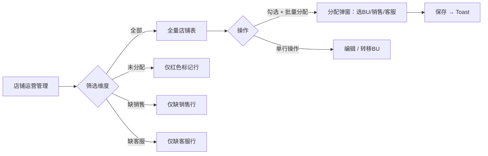
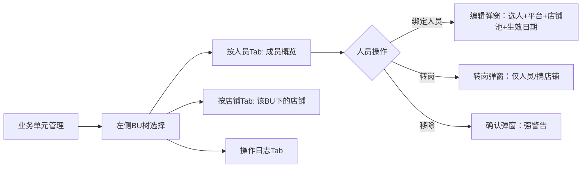
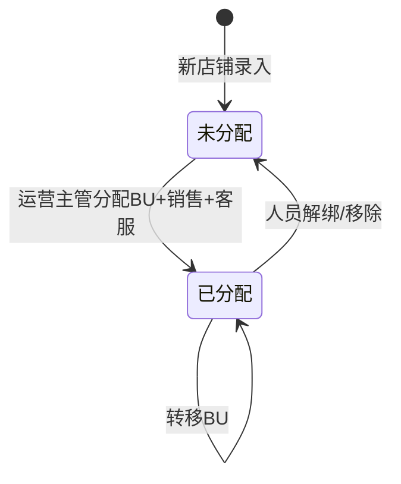

# PRD · 销售管理（店铺运营 & 业务单元）

> 本 PRD 基于已交付原型 V1.2 反向输出。页面结构、交互方式、组件行为均已在原型中实现并验证。
> 原型位置：`prototype/salesperson-management/index.html`

---

## 1. 背景与目标

### 1.1 背景

当前系统以单一「销售人员管理」页面承载店铺分配、人员管理和业务单元配置，三者耦合导致操作路径混乱——客服要给新店铺配销售员，必须先进 BU 树找到未知节点。

### 1.2 目标

- **业务目标**：新店铺从录入到分配 BU+销售+客服，操作步骤从跨页跳转降到单页完成
- **用户目标**：运营负责人能在 BU 维度看清「谁管哪些店」，也能在店铺维度快速分配人员和 BU
- **北极星指标**：店铺配置完整率（销售+客服+BU 三者齐全的店铺占比），口径 = `count(store_with_sales_cs_bu) / count(all_stores)`

### 1.3 非目标

- 不做组织架构编辑（BU 树增删改由 HR 系统同步）
- 不做自动分配规则引擎——所有分配由人工操作
- 不做销售目标的计算引擎——只做目标配置和拆解

---

## 2. 用户与场景

### 2.1 目标用户

| 角色 | 主要任务 | 频率 | 备注 |
|---|---|---|---|
| BU 负责人 | 管理本 BU 人员准入、查看店铺覆盖 | 日 1-3 次 | 按人员/店铺双维度查看 |
| 运营主管 | 新店铺分配 BU+销售+客服，跨 BU 转移店铺 | 日 5-20 次 | 店铺维度操作 |
| 管理员 | 审核归属转移、操作日志审计 | 周 1 次 | 只读+审计 |

### 2.2 用户故事

- 作为**运营主管**，我希望**在店铺列表直接看到哪些店铺缺销售/缺客服/未分配 BU**，以便**一次操作完成分配**。
- 作为**BU 负责人**，我希望**点击我的 BU 后看到组员列表和该 BU 下的店铺**，以便**快速评估人员覆盖是否合理**。

### 2.3 典型场景

新开了 3 个 Shopee 店（SPE055、AMZ-US-NEW01、TEMU-EU-003）。运营主管打开「店铺运营管理」→ 看到红色标记的 3 条未分配店铺 → 批量勾选 → 打开分配弹窗 → 选目标 BU「深圳速卖通工具组」→ 选销售员「张赛」→ 确认分配。完成后切到「业务单元管理」→ 点「深圳速卖通工具组」→ 按店铺 Tab → 确认 3 家店已出现在列表。

---

## 3. 业务流程与状态机

### 3.1 店铺运营管理主流程



### 3.2 业务单元管理主流程



### 3.3 店铺分配状态机



---

## 4. 功能详述

### 4.A 店铺运营管理 — 双视图之「店铺维度」

#### 4.1 功能定义

| 优先级 | 角色 | 功能点 | 触发条件 | 前置条件 |
|---|---|---|---|---|
| P0 | 运营主管 | 查看全量店铺列表，按状态/平台筛选 | 进入页面 | — |
| P0 | 运营主管 | 批量分配未分配店铺的 BU / 销售 / 客服 | 勾选 ≥1 条后点「批量分配」 | 已勾选 |
| P1 | 运营主管 | 单店铺转移 BU | 点行操作「转移BU」图标 | 店铺已分配 BU |
| P1 | 运营主管 | 编辑店铺的销售/客服 | 点行操作编辑图标 | — |

#### 4.2 字段取值逻辑

| 字段名 | 类型 | 必填 | 默认 | 校验 | 枚举值 | 逻辑描述 |
|---|---|---|---|---|---|---|
| `store_name` | string | ✅ | — | 非空 | — | 店铺编号/名称 |
| `platform` | enum | ✅ | — | — | Shopee / Amazon / 速卖通 / Temu | 所属平台 |
| `salesperson` | string | ❌ | — | 人员须存在于系统 | — | 销售负责人，可为空 |
| `customer_service` | string | ❌ | — | 人员须存在于系统 | — | 客服负责人，可为空 |
| `bu_name` | string | ❌ | — | BU 须存在于树中 | — | 归属业务单元，可为空 |
| `status` | enum | ✅ | — | — | unassigned / normal / no-sales / no-cs | 根据 salesperson/cs/bu 字段自动判定 |

#### 4.3 交互说明

| 场景 | 组件 | 触发动作 | 前端交互 | 后端逻辑 | 错误处理 |
|---|---|---|---|---|---|
| 页面加载 | DataTablePanel | 进入页面 | 加载全量店铺，未分配行红色高亮置顶 | 查询店铺表 | 空态文案 |
| 状态筛选 | StoreFilterChip | 点击芯片 | 表格实时过滤（unassigned / no-sales / no-cs / all） | — | — |
| 平台筛选 | Select | 选择平台 | 表格实时过滤 | — | — |
| 批量分配 | BatchActionBar + Modal | 勾选 + 点击 | 弹分配 Modal，选 BU/销售/客服 | 批量更新 store 表 | 部分失败 Toast |
| 单行转移BU | IconButton | 点击 | 弹转移 Modal：当前BU → 目标BU | 更新 store.bu | 跨BU人员自动解绑警告 |

#### 4.4 功能阐述

| 路径 | 步骤 | 系统行为 | 用户感知 |
|---|---|---|---|
| 正向 | 1. 进入「店铺运营管理」 | 加载全量 32 条店铺，未分配 3 条红色高亮 | 表格首行红底 |
| 正向 | 2. 点「未分配」筛选芯片 | 仅显示 3 条未分配行 | 表格收缩到 3 行 |
| 正向 | 3. 勾选 3 条 + 点「批量分配」 | 弹 Modal，预填店铺列表 | Modal 含 3 个 tag |
| 正向 | 4. 选 BU+销售+客服 + 确认 | Toast「3 家店铺已分配至目标业务单元」 | 行变正常色，从未分配列表消失 |
| 异常 | 转移 BU 到不属于销售员的 BU | 警告条：「该店铺当前销售员XX不属于目标BU，转移后自动解绑」 | 红色 Alert |

#### 4.5 逆向流程搭建

| 逆向场景 | 触发角色 | 触发条件 | 数据影响 | 状态回退规则 | 限制条件 |
|---|---|---|---|---|---|
| — | — | — | — | — | 本次不涉及（分配为正向操作，通过转移BU覆盖） |

#### 4.6 功能权限清单

| 角色 | 页面权限 | 按钮权限 | 字段权限 | 数据范围 |
|---|---|---|---|---|
| 运营主管 | 可见 | 全部可操作 | 全部可编 | 全公司店铺 |
| BU 负责人 | 可见 | 只读（转移BU需主管） | 只读 | 全公司店铺 |
| 管理员 | 可见 | 只读 | 只读 | 全公司店铺 |

#### 4.7 上线前历史数据处理

| 数据对象 | 来源 | 是否迁移 | 处理 |
|---|---|---|---|
| — | — | — | 本次不涉及 |

---

### 4.B 业务单元管理 — 双视图之「BU 维度」

#### 4.1 功能定义

| 优先级 | 角色 | 功能点 | 触发条件 | 前置条件 |
|---|---|---|---|---|
| P0 | BU 负责人 | 查看本 BU 成员列表 | 点击左侧 BU 节点 | — |
| P0 | BU 负责人 | 查看本 BU 下的店铺（BU 维度按店铺） | 点击「按店铺」Tab | BU 已选中 |
| P0 | 管理员 | 查看操作日志 | 点击「操作日志」Tab | — |
| P1 | BU 负责人 | 绑定人员到 BU | 点击「绑定人员」按钮 | BU 已选中 |
| P1 | BU 负责人 | 人员转岗 | 点击行转岗图标 | 人员已在该 BU |
| P1 | BU 负责人 | 移除人员 | 点击行移除图标 | 人员已在该 BU |

#### 4.2 字段取值逻辑 — 绑定人员

| 字段名 | 类型 | 必填 | 默认 | 校验 | 枚举值 | 逻辑描述 |
|---|---|---|---|---|---|---|
| `salesperson` | string | ✅ | — | 从人员列表选择 | — | 销售员姓名 |
| `role` | enum | ✅ | — | — | 负责人 / 组员 | 业务职能 |
| `platform_filter` | enum | ❌ | — | — | Shopee / Amazon / 速卖通 / Temu | 限定可分配店铺的平台 |
| `store_ids` | array | ❌ | — | — | — | 从店铺资源池勾选的店铺 |
| `effective_date` | date | ✅ | — | ≥ 今天，不可过往日期 | — | 生效日期 |
| `permanent` | boolean | ✅ | true | — | — | 是否长期有效 |

#### 4.3 交互说明

| 场景 | 组件 | 触发动作 | 前端交互 | 后端逻辑 | 错误处理 |
|---|---|---|---|---|---|
| BU 节点选择 | TreeNav | 点击节点 | 页面标题变 BU 名，加载成员列表 | 查询 person 表 by BU | — |
| 按人员查看 | DataTablePanel | 默认 Tab | 表格含：姓名/行政组织/业务单元/BU/店铺(可展开)/职能/操作 | — | — |
| 按店铺查看(BU维度) | DataTablePanel | 点击「按店铺」Tab | 标题保持 BU 名 + 提示条「当前展示 XX BU 下的店铺」 | 查询 store 表 by BU | 空态文案 |
| 绑定人员 | CreateModal | 点击「绑定人员」 | 弹窗含：选择销售员、业务职能、平台筛选、店铺资源池树表、生效日期 | 创建 person-store 关联 | 日期校验：过往日期红色警告 |
| 店铺资源池勾选 | TreeTable+Checkbox | 勾选店铺 | 下方显示已选标签（支持×取消），勾到他人店铺时行高亮 | — | 保存时触发归属转移二次确认 |
| 转岗 | Modal | 点击行转岗图标 | 弹窗：选目标 BU → 仅人员转岗 / 携店铺转岗 | 更新 person.bu + store 归属 | 携店铺转岗时警告条 |
| 移除 | ConfirmModal | 点击行移除图标 | 弹窗含强警告「名下X个店铺将进入待归属订单池」 | 解除 person-BU 关联 | — |
| 操作日志 | DataTablePanel | 点击「操作日志」Tab | 表格含：时间/类型/对象/详情/操作人；支持筛选 | 查询 audit_log 表 | — |

#### 4.4 功能阐述

| 路径 | 步骤 | 系统行为 | 用户感知 |
|---|---|---|---|
| 正向(BU) | 1. 点「深圳速卖通工具组」 | 标题变 BU 名，默认按人员 Tab | 7 人列表，沈浩楠为负责人 |
| 正向(BU) | 2. 点「按店铺」Tab | 标题保持 BU 名，提示「当前展示深圳速卖通工具组下的店铺」 | SMT033、SMT008 等 6 条 |
| 正向(BU) | 3. 点「绑定人员」 | 弹窗，默认组员，必须选人 | 选择张赛 → 勾店铺 → 设生效日期 |
| 正向(BU) | 4. 点确定 | 保存，若勾到他人店铺弹出归属转移二次确认 | Toast「人员配置保存成功」 |
| 异常 | 生效日期选昨天 | 红色提示「⚠️ 不允许选择过往日期」 | 无法提交 |

#### 4.5 逆向流程 — 移除人员

| 逆向场景 | 触发角色 | 触发条件 | 数据影响 | 状态回退规则 | 限制条件 |
|---|---|---|---|---|---|
| 解除人员-BU 关联 | BU 负责人 | 点击移除 | 人员失去 BU 归属，其店铺失去销售归属 | 店铺进入「待归属」状态 | 需二次确认 |

#### 4.6 功能权限清单

| 角色 | 页面权限 | 按钮权限 | 字段权限 | 数据范围 |
|---|---|---|---|---|
| BU 负责人 | 可见 | 绑定/转岗/移除可操作 | 本 BU 人员可编 | 本 BU |
| 运营主管 | 可见 | 全部可操作 | 全部可编 | 全公司 BU |
| 组员 | 可见 | 只读 | 只读 | 本 BU |

#### 4.7 上线前历史数据处理

| 数据对象 | 来源 | 是否迁移 | 处理 |
|---|---|---|---|
| — | — | — | 本次不涉及 |

---

### 4.C 订单归属处理

#### 4.1 功能定义

| 优先级 | 角色 | 功能点 | 触发条件 | 前置条件 |
|---|---|---|---|---|
| P0 | 运营主管 | 查看待归属订单列表 | 进入「订单归属处理」页 | — |
| P0 | 运营主管 | 单条/批量重新匹配订单归属 | 点击「重新匹配」或批量勾选 | 订单存在异常原因 |
| P1 | 管理员 | 新建调整任务（历史订单覆盖） | 点击「新建调整任务」 | — |
| P1 | 管理员 | 查看历史调整记录 | 进入「历史订单调整」Tab | — |

#### 4.2 交互说明

| 场景 | 组件 | 触发动作 | 前端交互 |
|---|---|---|---|
| 待归属订单列表 | DataTablePanel + BatchActionBar | 进入页面 | 表格含：订单号(可复制)/创建时间/平台/出单店铺/异常原因/操作 |
| 单条重新匹配 | Button(link) | 点击 | Toast「重新匹配成功，该订单已归属」 |
| 批量重新匹配 | BatchActionBar + Button | 勾选 + 点击 | Toast「批量重新匹配已提交，N 笔成功」 |
| 新建调整任务 | DetailDrawer | 点击按钮 | 全屏抽屉：Step1 圈定范围 → Step2 核对明细 → Step3 设定规则 |
| 调整任务提交 | ConfirmModal | 确认 | 危险确认「此操作将永久记录审计日志」 |

#### 4.3 异常原因枚举

| 原因 | 说明 |
|---|---|
| 店铺未配置归属规则 | 新店铺无销售/客服配置 |
| 对应销售员已解绑或失效 | 人员被移除或转岗 |
| 业务单元被停用 | BU 被停用导致下属订单悬空 |

---

### 4.D 销售目标制定

#### 4.1 功能定义

| 优先级 | 角色 | 功能点 | 触发条件 | 前置条件 |
|---|---|---|---|---|
| P0 | BU 负责人 | 查看本 BU 年度目标矩阵 | 进入页面 + 选 BU | — |
| P0 | BU 负责人 | 编辑未来月份目标 | 开启编辑模式 + 点击单元格 | 月份未锁定(05月+) |
| P1 | BU 负责人 | 导入年度目标（Excel 模板） | 点击「导入年度目标」 | — |
| P1 | BU 负责人 | 导出当前数据 | 点击「导出」 | — |

#### 4.2 目标层级逻辑

```
BU 总盘子 → 人员承接 → 店铺可选拆解
- 人员目标之和 ≤ BU 目标
- 店铺目标之和 = 人员目标（拆解平齐）
- 差额集中在汇总列展示
```

#### 4.3 交互说明

| 场景 | 组件 | 触发动作 | 前端交互 |
|---|---|---|---|
| 矩阵查看 | MatrixTable | 进入页面 | BU行/人员行/店铺行三级树表格，01-04月锁定灰色，05-12月可编辑蓝色 |
| 编辑模式 | Toggle + InlineEdit | 开启编辑 | 可编辑单元格变蓝色可点，点击出现 `<input>` 框，Enter 确认 |
| 保存校验 | ConfirmModal | 点击保存 | 强校验：店铺拆解不平 → 阻断弹窗；弱校验：BU 有差额 → 确认弹窗 |
| 导入模板 | Drawer(3-step) | 点击导入 | Step1 下载模板 → Step2 上传 → Step3 结果反馈(成功/失败/跳过) |

#### 4.4 保存校验规则

| 校验级别 | 条件 | 行为 |
|---|---|---|
| 强校验(阻断) | 人员目标 ≠ 店铺目标合计 | 弹窗「无法保存：店铺拆解不平齐」，列出差额明细 |
| 弱校验(确认) | BU 总目标 > 人员目标合计 | 弹窗「BU 目标存在差额 ¥X」，可选继续保存或返回调整 |

---

## 5. 埋点与可观测性

| 事件名 | 触发时机 | 携带参数 | 用途 |
|---|---|---|---|
| `store_assign_batch` | 批量分配店铺完成 | `count`、`bu_name` | 衡量运营效率 |
| `bu_member_bind` | 绑定人员 | `role`、`store_count` | 衡量人员配置 |
| `bu_member_transfer` | 人员转岗 | `type`(person/store)、`target_bu` | 衡量组织变动 |
| `target_edit_save` | 目标保存 | `changed_cells`、`has_block` | 衡量编辑深度 |
| `order_reattribute_batch` | 批量重新匹配 | `count`、`success_count` | 衡量匹配效率 |

---

## 6. 风险、合规与性能要求

| 维度 | 要求 | 备注 |
|---|---|---|
| 并发 | 分配操作幂等，同店铺不可同时被分配 | 后端 optimistic lock |
| 数据脱敏 | — | 本次不涉及 |
| 审计 | 所有分配/转岗/移除/调整操作写入 audit_log | 操作日志页签可查 |
| 容灾 | 表单填写中途断网 → 数据不丢失，恢复后提示 | <待确认> |

---

## 7. 验收标准（BDD）

```
Scenario 1: 运营主管批量分配未分配店铺
  Given 店铺运营管理页显示 3 条红色未分配店铺
  When 勾选全部 3 条 → 点「批量分配」→ 选 BU「深圳速卖通工具组」→ 选销售员「张赛」→ 确认
  Then Toast「3 家店铺已分配至目标业务单元」
    And 3 条行红色消失，变为正常色
    And 未分配计数从 3 变为 0

Scenario 2: BU 负责人查看本 BU 下的店铺
  Given 业务单元管理页 → 左侧选「深圳速卖通工具组」
  When 点击「按店铺」Tab
  Then 标题保持「深圳速卖通工具组」
    And 提示条显示「当前展示 深圳速卖通工具组 下的店铺数据」
    And 表格仅展示该 BU 的店铺（SMT033, SMT008 等）

Scenario 3: 绑定人员时日期选过往
  Given 业务单元管理 → 点击「绑定人员」
  When 生效日期选 2026-05-01（过去）
  Then 显示红色提示「⚠️ 不允许选择过往日期」
    And 确定按钮可点但预期后端也会拒绝

Scenario 4: 保存目标时店铺拆解不平
  Given 销售目标矩阵中王五 05月个人目标 ¥500,000，但店铺合计 ¥497,000
  When 点击「保存修改」
  Then 弹窗阻断「无法保存：店铺拆解不平齐」
    And 显示差额明细「王五 05月差额 ¥3,000」

Scenario 5: 店铺运营管理页按平台筛选
  Given 店铺运营管理页展示全部 32 条店铺
  When 在平台下拉选择「Shopee」
  Then 表格仅展示 Shopee 平台店铺
```

---

## 8. 页面结构总览

| 页面 | 路由 | 侧边栏 | 主内容 |
|---|---|---|---|
| 店铺运营管理 | `/sales/store-ops` | 店铺状态筛选（未分配/全部） | 全量店铺表 + 平台筛选 + 批量分配 |
| 业务单元管理 | `/sales/bu-mgmt` | BU 组织树 | 按人员 Tab + 按店铺 Tab(BU维度) + 操作日志 Tab |
| 订单归属处理 | `/sales/order-attribution` | — | 待归属订单 Tab + 历史订单调整 Tab |
| 销售目标制定 | `/sales/targets` | BU 组织树 | 年度目标矩阵 + 导入导出 |

---

## 9. 设计基线

- **UI 库**：Ant Design ERP UI Library (Figma `KaI3eGyylfiwrPlU3OR08C` v0.2.1)
- **原型**：`prototype/salesperson-management/index.html`（静态 HTML + inline JS）
- **风格**：中文 B 端 ERP，浅灰背景 #F8FAFC，白色面板，Ant Design 蓝 #3B82F6
- **组件规范**：所有 `<input type="date">` 包裹 `.date-input-wrap`；所有 `<select>` ≥2 个 `<option>`；所有 `.sel-tag .x` 有 `onclick`
- **交付前检查**：`bash prototype/salesperson-management/check-consistency.sh` 三项全绿

---

## 10. 原型生成输入包（给 Codex / Claude 自生原型用）

### 10.1 页面清单

| page_id | 标题 | 侧边栏组件 | 主内容组件 |
|---|---|---|---|
| `page-store` | 店铺运营管理 | TreeNav(店铺状态: 未分配danger+全部) | DataTablePanel(店铺表) + StoreFilterChip + Select(平台) + BatchActionBar |
| `page-bu` | 业务单元管理 | TreeNav(BU树, 含展开/折叠, data-bu-name) | SegmentedTabs(按店铺/按人员/操作日志) + DataTablePanel + CreateModal + 转岗Modal + 移除Confirm |
| `page-order` | 订单归属处理 | — | PageTabs(待归属/历史调整) + DataTablePanel + DetailDrawer |
| `page-target` | 销售目标制定 | TreeNav(BU树) | Dashboard + Toggle(编辑模式) + MatrixTable + Drawer(导入3-step) |

### 10.2 双视图核心逻辑

- **店铺运营管理**：展示全量店铺，数据属性 `data-type`(unassigned/normal/no-cs/no-sales) + `data-bu`(BU名称)
- **业务单元管理·按店铺**：调用 `filterStoreByBu(currentBuName)` 过滤仅当前BU的店铺
- **BU 切换**：`setPageContext('bu', name, el)` 更新标题 + 选中态
- **店铺上下文**：`setPageContext('store', 'all'/'unassigned')` 仅用于店铺运营管理页

### 10.3 关键组件约束

| 组件 | 约束 |
|---|---|
| 日期输入 | 必须 `.date-input-wrap` 包裹 + `min` 属性 + `onchange` 校验 |
| Select | 必须 ≥2 个 `<option>`，占位符用 `value=""` |
| sel-tag × | 必须有 `onclick="removeStoreTag(this,'<id>')"` + `title` |
| 未分配店铺 | 使用 `.tree-node.danger` 样式（红色圆点 + 红色角标），非独立卡片 |
| seg-tab | onclick 必须调用 `setPageContext`，不能直接 `showBuTab` |

### 10.4 已确认的 Mock 数据

**人员列表**：沈浩楠(负责人)、张赛、廖中霞、黄爱纯、张旭、万恩、李洋

**店铺列表**（深圳速卖通工具组 BU 下）：SMT033(张赛/赵六)、SMT008(张赛/缺客服)、SMT072(黄爱纯)、SMT100(张旭/万恩)、SMT048(张旭/缺客服)、SMT085(万恩/李洋)

**未分配店铺**：SPE055(Shopee)、AMZ-US-NEW01(Amazon)、TEMU-EU-003(Temu)
