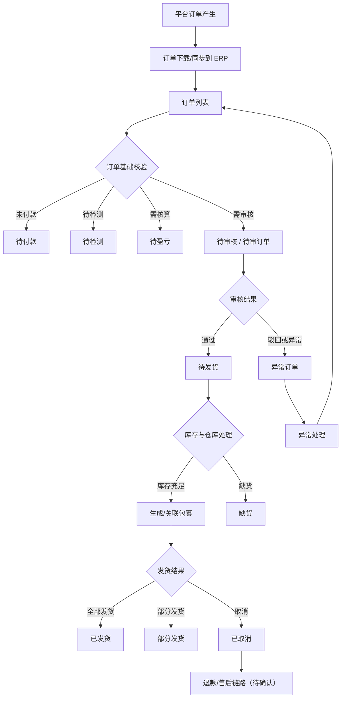
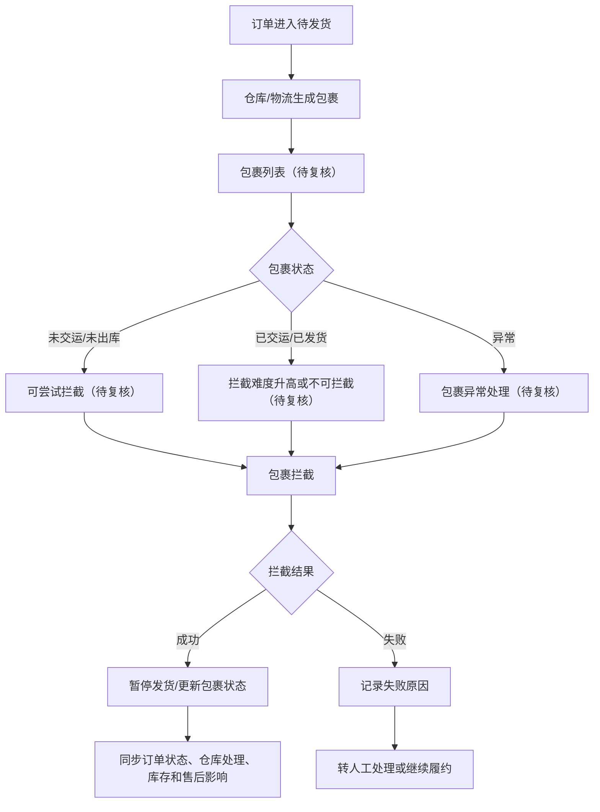
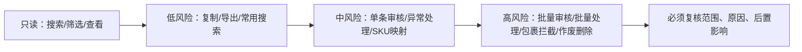

# ERP 订单与包裹流程 Mermaid 图

> 说明：订单列表和待审订单节点基于测试环境已观察页面；包裹列表和包裹拦截节点因测试环境 OMS 空响应，包含合理推断并在图中标注待复核。

## 订单主流程

```mermaid
flowchart TD
    A["平台订单产生"] --> B["订单下载/同步到 ERP"]
    B --> C["订单列表"]
    C --> D{"订单基础校验"}
    D -->|未付款| E["待付款"]
    D -->|待检测| F["待检测"]
    D -->|需核算| G["待盈亏"]
    D -->|需审核| H["待审核 / 待审订单"]
    H --> I{"审核结果"}
    I -->|通过| J["待发货"]
    I -->|驳回或异常| K["异常订单"]
    J --> L{"库存与仓库处理"}
    L -->|库存充足| M["生成/关联包裹"]
    L -->|缺货| N["缺货"]
    M --> O{"发货结果"}
    O -->|全部发货| P["已发货"]
    O -->|部分发货| Q["部分发货"]
    O -->|取消| R["已取消"]
    K --> S["异常处理"]
    S --> C
    R --> T["退款/售后链路（待确认）"]
```

## 包裹与拦截流程

```mermaid
flowchart TD
    A["订单进入待发货"] --> B["仓库/物流生成包裹"]
    B --> C["包裹列表（待复核）"]
    C --> D{"包裹状态"}
    D -->|未交运/未出库| E["可尝试拦截（待复核）"]
    D -->|已交运/已发货| F["拦截难度升高或不可拦截（待复核）"]
    D -->|异常| G["包裹异常处理（待复核）"]
    E --> H["包裹拦截"]
    F --> H
    H --> I{"拦截结果"}
    I -->|成功| J["暂停发货/更新包裹状态"]
    I -->|失败| K["记录失败原因"]
    J --> L["同步订单状态、仓库处理、库存和售后影响"]
    K --> M["转人工处理或继续履约"]
    G --> H
```

## 风险等级流转图

```mermaid
flowchart LR
    R0["只读：搜索/筛选/查看"] --> R1["低风险：复制/导出/常用搜索"]
    R1 --> R2["中风险：单条审核/异常处理/SKU映射"]
    R2 --> R3["高风险：批量审核/批量处理/包裹拦截/作废删除"]
    R3 --> C["必须复核范围、原因、后置影响"]
```
