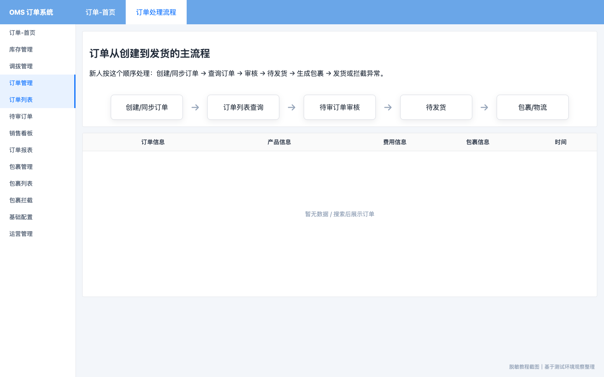
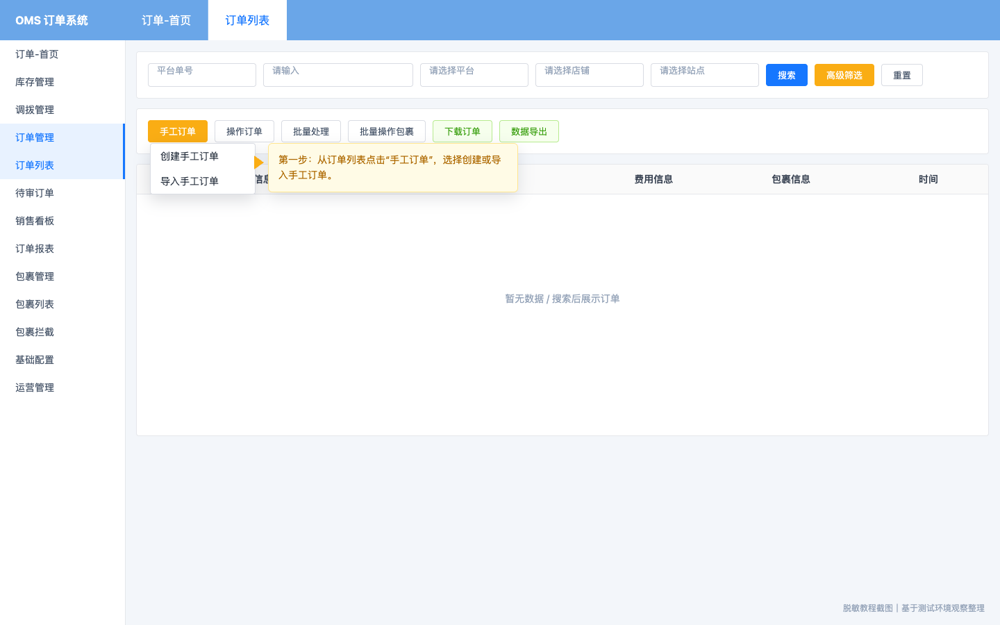
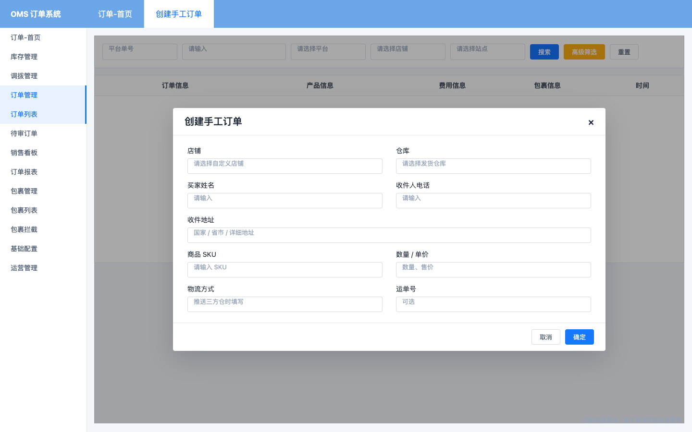
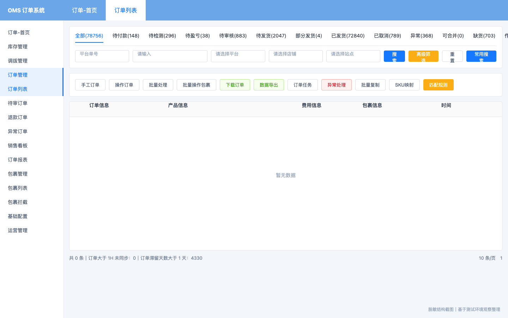
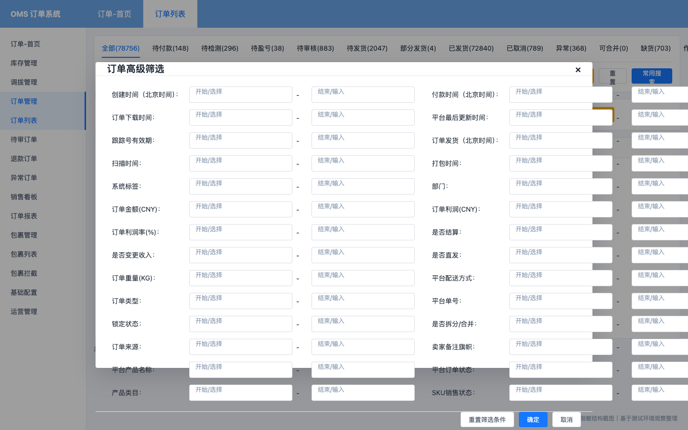
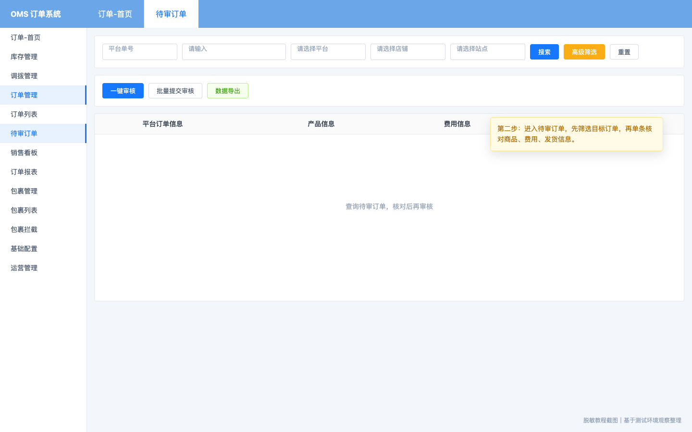
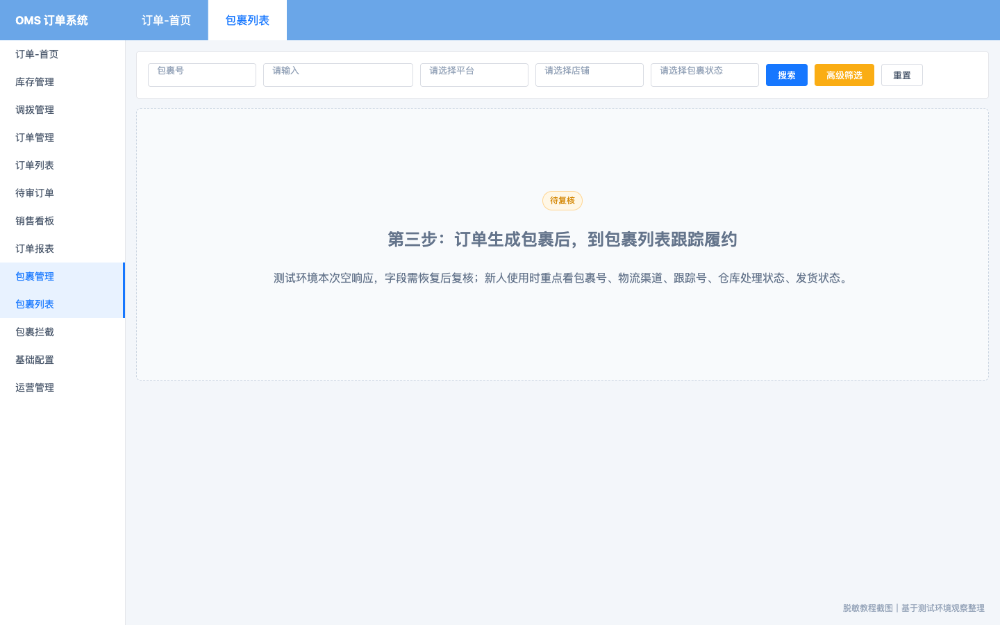
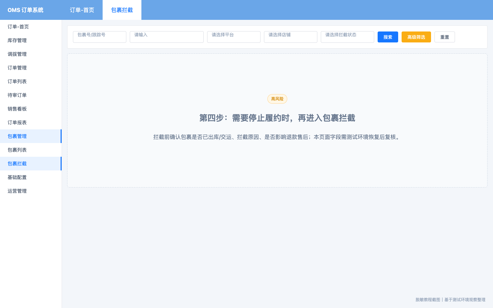

# ERP 订单与包裹流程新人操作手册

> 适用对象：第一次使用订单系统的新员工
> 调研日期：2026-05-07
> 说明：本文不记录登录密码、token 或内部账号信息。截图为脱敏教程截图，核心字段和入口基于测试环境观察整理；包裹列表、包裹拦截页面因测试环境 OMS 空响应，具体字段需恢复后复核。

## 一、这个系统是做什么的

订单系统用于统一管理跨平台、跨店铺的订单。新人不需要在多个平台和店铺之间反复切换，可以在 ERP 中完成订单查询、订单审核、异常处理、包裹查看和包裹拦截。

它主要解决这些问题：

| 问题 | 系统如何解决 |
|------|--------------|
| 多平台订单分散 | 在订单列表集中查询和处理订单 |
| 不知道订单处于哪一步 | 用状态页签区分待付款、待审核、待发货、已发货、异常等状态 |
| 审核和发货前信息容易漏看 | 在待审订单中集中核对商品、费用和发货信息 |
| 订单和包裹割裂 | 订单列表展示包裹信息，包裹管理承接履约跟踪 |
| 异常订单处理没有抓手 | 通过异常页签、异常处理和包裹拦截处理异常 |

新人只要先记住一条主线：

`创建/同步订单 -> 订单列表查询 -> 待审订单审核 -> 待发货 -> 包裹/物流 -> 已发货或异常处理`

## 二、第一次进入系统

1. 打开测试环境登录页：`/yh-admin/login`。
2. 使用分配给你的测试账号登录。
3. 登录后进入系统门户首页。
4. 在系统门户中点击 `订单管理 / OMS 订单管理`，进入订单系统。
5. 进入后左侧菜单会看到 `订单管理` 和 `包裹管理`。

常用入口：

- `订单管理 > 订单列表`
- `订单管理 > 待审订单`
- `包裹管理 > 包裹列表`
- `包裹管理 > 包裹拦截`

## 三、订单从创建到后续处理的完整流程

### 第一步：创建或同步订单

订单进入 ERP 通常有两种方式：

| 方式 | 适用场景 | 操作入口 |
|------|----------|----------|
| 平台订单同步 | 平台店铺已授权，订单从平台同步进 ERP | 订单列表中的下载订单/订单同步类能力 |
| 手工订单 | 线下订单、补录订单、未自动同步订单 | `订单列表 > 手工订单` |

#### 1. 创建手工订单

进入 `订单管理 > 订单列表`，点击页面上方的 `手工订单`，选择 `创建手工订单`。如果需要一次创建多张订单，可选择 `导入手工订单`。

进入创建页面后，按实际业务填写订单信息。新人至少要关注这些信息：

| 信息 | 为什么重要 |
|------|------------|
| 店铺 | 决定订单归属和后续统计口径 |
| 仓库 | 决定从哪个仓库扣库存和发货 |
| 买家姓名、电话、地址 | 决定包裹收件信息 |
| 商品 SKU、数量、单价 | 决定订单商品、库存扣减和费用核算 |
| 物流方式、运单号 | 若要推送仓库或物流，需要补全 |

填写完成后点击 `确定`。创建成功后，订单会进入订单列表，并按系统规则进入待审核、待发货或其他状态。

注意：如果页面要求必填字段，先补齐再提交；如果商品 SKU 无法匹配，先处理 SKU 映射或商品配对问题。

### 第二步：在订单列表查询订单

进入 `订单管理 > 订单列表`。这是新人最常用的页面，用来找订单、看状态、看商品、看费用、看包裹。

常用查询方式：

1. 选择单号类型，默认可用 `平台单号`。
2. 输入订单号或关键词。
3. 选择平台、店铺、站点。
4. 点击 `搜索`。
5. 在表格中查看 `订单信息`、`产品信息`、`费用信息`、`包裹信息`、`时间`。

订单列表顶部有状态页签，常见含义如下：

| 状态 | 新人理解 |
|------|----------|
| 全部 | 所有订单 |
| 待付款 | 买家还未完成付款 |
| 待检测 | 系统或业务规则还在检测订单 |
| 待盈亏 | 需要核算利润、费用或成本 |
| 待审核 | 需要人工或系统审核 |
| 待发货 | 审核后等待仓库/物流处理 |
| 部分发货 | 订单部分商品或包裹已发出 |
| 已发货 | 已进入发货状态 |
| 已取消 | 订单已取消 |
| 异常 | 订单存在需要处理的问题 |
| 缺货 | 库存不足，无法正常发货 |
| 作废 | 订单被作废，不再按正常流程处理 |

### 第三步：用高级筛选缩小范围

当订单很多时，不要只靠关键词搜索。点击 `高级筛选`，可以按时间、金额、仓库、物流、包裹状态等条件查找订单。

新人常用筛选建议：

| 场景 | 建议筛选 |
|------|----------|
| 查某天付款订单 | 付款时间 |
| 查某个平台最新同步订单 | 平台、店铺、平台最后更新时间 |
| 查待发货压力 | 订单状态、剩余发货时间、发货仓库 |
| 查物流问题 | 物流渠道、跟踪号有效期、包裹状态 |
| 查异常或滞留订单 | 是否有异常、滞留时长、订单状态 |
| 查利润问题 | 订单金额、订单利润、订单利润率 |

筛选后如果结果不符合预期，先点 `重置`，避免旧条件继续生效。

### 第四步：审核待审订单

进入 `订单管理 > 待审订单`。这个页面专门处理需要审核的订单。

审核前按顺序检查：

1. 平台订单信息是否正确。
2. 产品信息是否完整，SKU 是否能匹配。
3. 费用信息是否异常，例如金额、利润、成本。
4. 发货信息是否完整，例如仓库、物流、收件信息。
5. 如果确认无问题，再执行审核。

页面已确认按钮：

| 按钮 | 新人怎么用 |
|------|------------|
| 一键审核 | 适合规则明确、订单风险低时使用 |
| 批量提交审核 | 适合多张订单一起推进审核，操作前必须确认筛选范围 |
| 数据导出 | 导出当前数据用于核对 |

新人建议：刚开始优先单条核对，不要一上来批量审核。测试环境可以试错，但真实工作中批量审核会影响后续发货。

### 第五步：处理待发货、缺货和异常订单

审核通过后，订单通常会进入待发货链路。此时重点看三个方向：

| 情况 | 处理方式 |
|------|----------|
| 信息完整且库存正常 | 等待仓库/物流生成包裹并发货 |
| 缺货 | 查看缺货原因，等待补库存或按业务规则处理 |
| 异常 | 进入异常状态页签或使用异常处理，先定位异常来源 |

常见异常来源：

- 商品 SKU 没有匹配。
- 库存不足。
- 仓库或物流渠道缺失。
- 买家地址、电话等信息异常。
- 平台订单状态与 ERP 状态不一致。
- 费用、利润、成本异常。

异常处理原则：先看清原因，再处理；能单条处理时不要直接批量处理。

### 第六步：查看包裹和物流履约

订单生成包裹后，可以在订单列表的 `包裹信息` 列查看，也可以进入 `包裹管理 > 包裹列表` 集中查看。

包裹列表新人重点看：

| 信息 | 用途 |
|------|------|
| 包裹号 | ERP 内部包裹识别 |
| 平台/店铺 | 判断订单来源 |
| 物流渠道 | 判断使用哪条物流线路 |
| 跟踪号 | 查物流轨迹 |
| 包裹状态 | 判断是否待发货、已发货、异常 |
| 仓库处理状态 | 判断是否扫描、打包、出库 |

本次测试环境包裹列表路径出现空响应，以上字段需在服务恢复后复核。

### 第七步：需要停止履约时处理包裹拦截

当订单已经生成包裹，但因为取消、退款、地址错误、商品异常等原因需要停止发货时，进入 `包裹管理 > 包裹拦截`。

拦截前必须确认：

1. 是否已经出库。
2. 是否已经交运给物流。
3. 为什么要拦截。
4. 拦截失败后怎么处理。
5. 是否影响退款、库存、客服沟通。

包裹拦截是高风险操作。即使是测试环境，也建议先用单个包裹试操作，弄清楚状态变化后再批量处理。

### 第八步：复查订单最终状态

每次审核、异常处理、包裹处理或拦截后，都要回到订单列表复查：

- 订单是否还在原状态。
- 是否进入待发货、已发货、异常、缺货、已取消或作废。
- 包裹信息是否生成或更新。
- 费用、利润、库存、物流是否出现异常。
- 是否需要继续走退款或售后流程。

## 四、新人常用按钮速查

| 按钮 | 作用 | 风险 |
|------|------|------|
| 搜索 | 查询订单 | 只读 |
| 高级筛选 | 按更多条件查订单 | 只读 |
| 重置 | 清空当前筛选 | 只读 |
| 常用搜索 | 使用保存的查询条件 | 低风险 |
| 手工订单 | 创建或导入手工订单 | 中风险 |
| 一键审核 | 快速审核待审订单 | 中风险 |
| 批量提交审核 | 批量推进审核 | 高风险 |
| 批量处理 | 批量改变订单处理状态 | 高风险 |
| 批量操作包裹 | 批量影响包裹状态 | 高风险 |
| 异常处理 | 处理订单异常 | 中到高风险 |
| SKU映射 | 调整商品匹配关系 | 中风险 |
| 数据导出 | 导出数据核对 | 低风险 |
| 包裹拦截 | 停止或干预包裹履约 | 高风险 |

## 五、操作风险等级

| 等级 | 定义 | 新人注意事项 |
|------|------|--------------|
| 只读 | 不改变业务数据 | 可以放心试，例如搜索、筛选、查看 |
| 低风险 | 影响轻或只是导出 | 注意别导出错范围 |
| 中风险 | 会改变单条订单或匹配关系 | 先单条操作，观察状态变化 |
| 高风险 | 批量改变订单/包裹，影响仓库、物流、费用、售后 | 操作前确认筛选范围、勾选范围和后置影响 |

## 六、第一次使用建议

1. 先只做查询和筛选，熟悉状态页签。
2. 再找一张测试订单，查看订单信息、产品信息、费用信息、包裹信息。
3. 再进入待审订单，练习单条审核。
4. 再看包裹列表，理解订单和包裹的关系。
5. 最后再尝试包裹拦截、批量审核、批量处理这类高风险动作。

## 七、待复核问题

由于本次调研时 OMS 业务路径出现空响应，以下内容需要服务恢复后补充截图和规则：

- 包裹列表的真实字段、按钮、详情页。
- 包裹拦截的可拦截条件、拦截状态、失败原因。
- 手工订单创建弹窗的真实必填字段。
- 单条审核的弹窗字段、审核通过/驳回后的状态变化。
- 订单详情页入口和字段分组。
- 订单与库存、仓储、物流、退款之间的真实联动规则。
