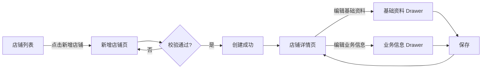
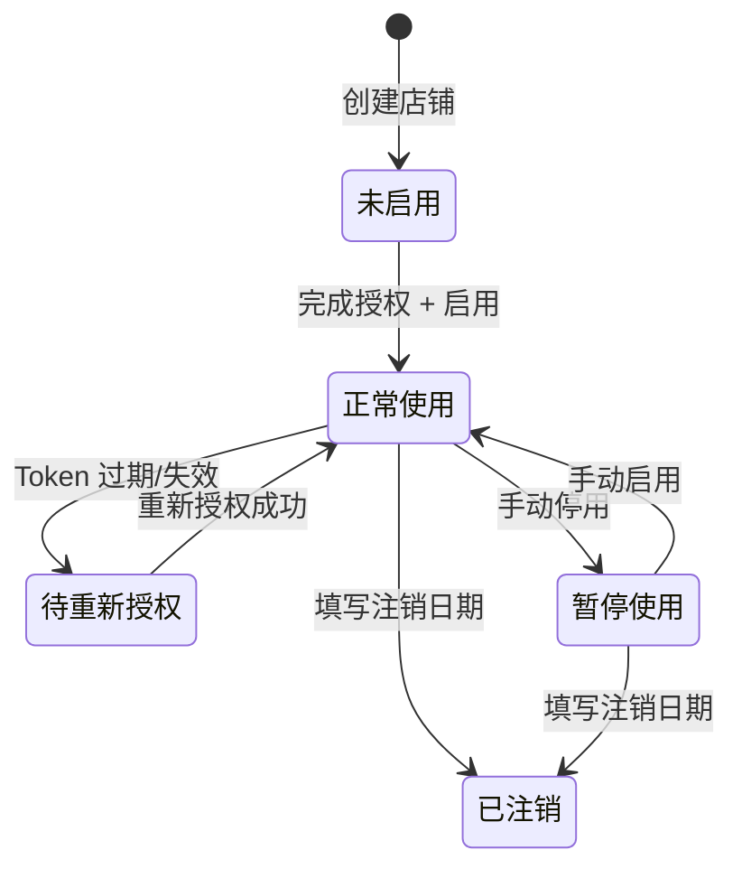

# 店铺新增与编辑 PRD

> 本文档统一店铺管理模块「新增页」与「编辑页」的字段定义、交互规范与校验规则，解决 Figma 自动生成导致的两页字段不一致问题。

---

## 冻结事实摘要表

| 维度 | 已确认内容 |
|---|---|
| 模块 | 店铺管理（店铺管理列表 → 新增/编辑/详情） |
| 系统 | 跨境电商自研 ERP，B 端后台 |
| 新增页 | 独立表单页，路径 `/store/create`，提交后跳转列表 |
| 编辑页 | 详情页（Tab: 基础资料/业务信息/授权信息/操作日志）+ 两个编辑 Drawer |
| 权威来源 | 编辑页字段以用户提供的「编辑 Drawer 设计最终方案」为准；新增页字段以编辑页为准对齐 |
| 字段对齐原则 | **以编辑页为准**，Figma 新增页多出的 8 个字段（主店铺名称/子店铺名称/店铺主体/类型/平台店铺类型/事业部/运营人员/客服人员）**全部删除** |
| 平台扩展字段 | 不做处理，系统已有设计（Amazon 区域 / Shopee 主账号+SIP / AliExpress 运费代扣支付宝） |
| 站点联动 | 站点下拉按所选平台联动过滤 |
| UI 框架 | Ant Design，按 `knowledge/figma-ant-design-ui-library.md` 执行 |

---

## 需求澄清表

| 序号 | 问题 | 当前状态 | 对 PRD 的影响 |
|---|---|---|---|
| 1 | Figma 新增页多出字段是否保留？编辑页是否同步增加？ | **已确认：不保留，以编辑页为准** | 已在 §4.2 删除多余字段 |
| 2 | 平台扩展字段是预留概念还是已有具体字段？ | **已确认：系统已有，不做处理** | 保持现状 |
| 3 | 新增页「店铺别名」是否等同于编辑页「云易盒店铺别名」？ | <假设：是> | 影响字段命名统一 |
| 4 | 新增页「是否立即启用」是否等同于编辑页「是否已启用」？ | <假设：是> | 影响字段命名统一 |
| 5 | 站点是否按平台联动过滤？ | **已确认：需要联动** | 已在 §4.3 补充联动逻辑 |

---

## 假设项表

| 假设 | 等级 | 依据 | 如果错误的影响 |
|---|---|---|---|
| 新增页与编辑页共用同一套底层数据模型，只是前端展现形式不同 | 中 | ERP 常规设计 | 低——字段可拆分为两张表 |
| 平台扩展字段当前按平台差异化展示（Amazon 区域 / Shopee 主账号+SIP / AliExpress 运费代扣支付宝），系统已有设计 | 低 | **已确认** | 低——保持现状 |
| 新增页字段分为「基础识别信息」「账号环境信息」「注册信息」「生命周期信息」「收款信息」「保证金信息」「备注」7 组，与编辑页分组一致 | 低 | 保持编辑页结构一致性，降低认知负荷 | 低——分组可调整 |

---

## 1. 背景与目标

### 1.1 背景

现状：店铺管理模块已有编辑页交互规范（详情页 + 两个编辑 Drawer），但缺少新增页的 PRD 定义。Figma AI 生成新增页时自行补充了字段（如主店铺名称、子店铺名称、事业部、运营人员等），与编辑页字段集合不一致。

痛点：
- 新增页与编辑页字段命名、分组、必填规则不统一，导致前端实现困惑
- 运营在新增时填的字段，编辑时可能看不到或改不了
- 数据模型缺少单一定义，容易产生脏数据

### 1.2 目标

- **一致性目标**：新增页与编辑页共用同一套字段定义、枚举值、校验规则
- **体验目标**：新增页按「基础信息 → 业务信息 → 收款/保证金 → 备注」分组，与编辑页分组对齐
- **数据目标**：创建时必填字段 ≤ 8 个，降低录入门槛；选填字段在编辑时补全

### 1.3 非目标

- 不做店铺授权流程（授权在编辑页「授权信息」Tab 独立完成）
- 不做批量导入店铺
- 不做店铺删除/注销的逆向流程（仅编辑「店铺使用状态」标记）

---

## 2. 用户与场景

| 角色 | 主要任务 | 频率 | 备注 |
|---|---|---|---|
| 运营专员 | 创建新店铺并填写基础信息 | 月均 3-10 次 | 主要使用者 |
| 运营主管 | 审核店铺信息、编辑店铺资料 | 按需 | 可查看全部字段 |
| 财务人员 | 查看收款/保证金信息 | 按需 | 只读，敏感账号需解锁 |

### 2.1 典型场景

**场景 A：创建新店铺**
运营小张接到业务部门需求，需要在 Shopee 新加坡站点开设新店铺。进入「新增店铺」页，选择平台/站点，填写云易盒店铺别名、后台店铺名称等必填项，保存后店铺进入「未启用」状态，随后走授权流程。

**场景 B：编辑店铺资料**
运营小李发现某店铺的后台店铺 ID 变更了，进入店铺详情 → 基础资料 Tab → 点击「编辑基础资料」Drawer → 修改后台店铺 ID → 保存。

---

## 3. 业务流程与状态机

### 3.1 店铺创建与编辑主流程



### 3.2 店铺状态机（简化）



---

## 4. 功能详述

### 4.1 功能定义

| 优先级 | 角色 | 功能点 | 触发条件 | 前置条件 |
|---|---|---|---|---|
| P0 | 运营专员 | 创建店铺 | 点击「新增店铺」按钮 | 有店铺管理菜单权限 |
| P0 | 运营专员/主管 | 编辑基础资料 | 详情页点击「编辑」 | 店铺已存在 |
| P0 | 运营专员/主管 | 编辑业务信息 | 详情页点击「编辑业务信息」 | 店铺已存在 |
| P1 | 运营专员/主管 | 查看资金完整账号 | 点击「查看完整账号」并解锁 | 店铺已存在，敏感字段脱敏态 |

### 4.2 字段取值逻辑表

> **统一规则**：新增页与编辑页共用以下字段模型。`页面`列标注该字段在哪些页面出现；`新建可编辑`指新增页是否可填；`编辑可编辑`指编辑 Drawer 中是否可改。

#### 4.2.1 基础识别信息

| 字段名 | 字段编码 | 类型 | 新建必填 | 新建可编辑 | 编辑可编辑 | 默认值 | 枚举值/校验 | 备注 |
|---|---|---|---|---|---|---|---|---|
| 平台 | `platform` | enum | ✅ | ✅ | ❌只读 | — | 保持当前 ERP 数据结构，按系统配置加载 | 创建后不可改 |
| 云易盒店铺别名 | `store_alias` | string | ✅ | ✅ | ✅ | — | 长度 2-50，唯一 | 列表页展示名 |
| 后台店铺 ID | `backend_store_id` | string | ❌ | ✅ | ✅ | — | 长度 ≤ 100 | |
| 后台店铺名称 | `backend_store_name` | string | ❌ | ✅ | ✅ | — | 长度 ≤ 100 | |
| 站点 | `site` | enum | ✅ | ✅ | ❌只读 | — | 保持当前 ERP 数据结构，按所选平台联动过滤 | 创建后不可改；联动平台过滤 |
| 区域 | `region` | string | ❌ | ✅ | ❌只读 | — | 仅 Amazon 展示；保持当前 ERP 数据结构 | 平台扩展字段 |
| 是否主账号 | `is_main_account` | boolean | ❌ | ✅ | ❌只读 | false | — | 仅 Shopee 展示；平台扩展字段 |
| 是否 SIP | `is_sip` | boolean | ❌ | ✅ | ❌只读 | false | — | 仅 Shopee 展示；平台扩展字段 |

#### 4.2.2 账号环境信息

| 字段名 | 字段编码 | 类型 | 新建必填 | 新建可编辑 | 编辑可编辑 | 默认值 | 枚举值/校验 | 备注 |
|---|---|---|---|---|---|---|---|---|
| 浏览器名称 | `browser_name` | enum | ❌ | ✅ | ✅ | — | 紫鸟 / 战斧 | |
| 浏览器店铺名称 | `browser_store_name` | string | ❌ | ✅ | ✅ | — | 长度 ≤ 100 | |

#### 4.2.3 注册信息

| 字段名 | 字段编码 | 类型 | 新建必填 | 新建可编辑 | 编辑可编辑 | 默认值 | 枚举值/校验 | 备注 |
|---|---|---|---|---|---|---|---|---|
| 账号注册类型 | `account_type` | enum | ❌ | ✅ | ✅ | — | 自注册 / 购买 | |
| 注册类型 | `registration_type` | enum | ❌ | ✅ | ✅ | — | 企业 / 个人 | |
| 注册公司/注册人 | `registration_company` | string | ❌ | ✅ | ✅ | — | 长度 ≤ 200 | |
| 注册日期 | `registration_date` | date | ❌ | ✅ | ✅ | — | 不能晚于今天 | |

#### 4.2.4 生命周期信息

| 字段名 | 字段编码 | 类型 | 新建必填 | 新建可编辑 | 编辑可编辑 | 默认值 | 枚举值/校验 | 备注 |
|---|---|---|---|---|---|---|---|---|
| 账号需求部门 | `demand_department` | enum | ❌ | ✅ | ✅ | — | 取公司组织架构一级事业部（优先展示业务部门） | 从组织架构 API 拉取 |
| 账号需求负责人 | `demand_leader` | enum | ❌ | ✅ | ✅ | — | 默认加载所选一级事业部的负责人 | 随部门联动；人员选择器组件 |
| 店铺使用状态 | `use_status` | enum | ❌ | ✅ | ✅ | 正常使用 | 正常使用 / 待重新授权 / 暂停使用 / 已注销 | |
| 是否已启用 | `is_enabled` | boolean | ❌ | ✅ | ✅ | true | — | 新增页文案「是否立即启用」；编辑页文案「是否已启用」 |
| 注销日期 | `deactivation_date` | date | ❌ | ✅ | ✅ | — | 不能早于今天 | use_status=已注销 时建议必填 |

#### 4.2.5 收款信息

| 字段名 | 字段编码 | 类型 | 新建必填 | 新建可编辑 | 编辑可编辑 | 默认值 | 枚举值/校验 | 备注 |
|---|---|---|---|---|---|---|---|---|
| 资金收款平台 | `fund_platform` | enum | ❌ | ✅ | ✅ | — | 系统预置 + 用户手动添加（见 §4.3.1） | 选择后「资金平台收款账号」必填；支持维护枚举值 |
| 资金平台收款账号 | `fund_account` | string | 条件必填 | ✅ | ✅ | — | 长度 ≤ 200 | fund_platform 有值时必填 |
| 资金平台收款账号 ID | `fund_account_id` | string | ❌ | ✅ | ✅ | — | 长度 ≤ 100 | |
| 速卖通运费代扣支付宝 | `ae_freight_alipay` | string | ❌ | ✅ | ✅ | — | 长度 ≤ 100 | 仅 platform=AliExpress 时展示 |

#### 4.2.6 保证金信息

| 字段名 | 字段编码 | 类型 | 新建必填 | 新建可编辑 | 编辑可编辑 | 默认值 | 枚举值/校验 | 备注 |
|---|---|---|---|---|---|---|---|---|
| 是否缴纳保证金 | `has_deposit` | boolean | ❌ | ✅ | ✅ | false | — | Switch 组件 |
| 保证金退回状态 | `deposit_refund_status` | enum | ❌ | ✅ | ✅ | 无需退回 | 无需退回 / 未退回 / 已退回 | has_deposit=true 时必填 |
| 保证金缴纳账号 | `deposit_account` | string | 条件必填 | ✅ | ✅ | — | 长度 ≤ 200 | has_deposit=true 时必填 |
| 保证金缴纳金额 | `deposit_amount` | decimal | 条件必填 | ✅ | ✅ | — | > 0，千分位格式化 | has_deposit=true 时必填 |
| 保证金退回时间 | `deposit_refund_time` | date | ❌ | ✅ | ✅ | — | — | deposit_refund_status=已退回 时建议必填 |
| 保证金退回流水号 | `deposit_refund_transaction_id` | string | ❌ | ✅ | ✅ | — | 长度 ≤ 100 | deposit_refund_status=已退回 时建议必填 |

#### 4.2.7 备注

| 字段名 | 字段编码 | 类型 | 新建必填 | 新建可编辑 | 编辑可编辑 | 默认值 | 枚举值/校验 | 备注 |
|---|---|---|---|---|---|---|---|---|
| 备注 | `remarks` | string | ❌ | ✅ | ✅ | — | 长度 ≤ 500，TextArea 4 行 | |

#### 4.2.8 站点-平台联动表

> 站点下拉选项按所选平台联动过滤，数据源保持当前 ERP 数据结构。切换平台时，若已选站点不在新平台支持范围内，自动清空已选站点。

| 平台 | 联动规则 | 备注 |
|---|---|---|
| Amazon | 按 ERP 配置加载对应站点列表 | — |
| Shopee | 按 ERP 配置加载对应站点列表 | — |
| AliExpress | 固定「全球」 | 单选项 |
| Lazada | 按 ERP 配置加载对应站点列表 | — |

### 4.3 交互说明

#### 4.3.1 新增店铺页

| 场景 | Ant Design 组件 | 触发动作 | 前端交互 | 后端逻辑 | 错误处理 |
|---|---|---|---|---|---|
| 页面进入 | `Form` + `Row/Col` + `Divider` | 路由进入 `/store/create` | 表单 `layout="vertical"`，分 7 组用 `Divider` 分隔；`gutter={24}`，`Col span=8` | — | — |
| 平台选择 | `Select` | 切换平台 | 1. 联动过滤「站点」可选项（见 §4.2.8），若已选站点不在新平台范围内则自动清空<br>2. 若为 AliExpress 展示「速卖通运费代扣支付宝」字段<br>3. 若为 Amazon 展示「区域」<br>4. 若为 Shopee 展示「是否主账号/是否 SIP」 | — | — |
| 站点选择 | `Select` `showSearch` `allowClear` | 选择 | 按平台过滤站点列表 | — | — |
| 是否缴纳保证金 | `Switch` | 切换 | `hasDeposit=false` 时自动将 `depositRefundStatus` 设为「无需退回」并隐藏缴纳账号/金额 | — | — |
| 保证金退回状态 | `Select` | 选「已退回」 | 展示「退回时间」「退回流水号」字段 | — | — |
| 提交保存 | `Button` `type="primary"` `htmlType="submit"` | 点击 | 前端校验 → POST `/api/stores` → 成功 Message.success → 跳转列表页 | 事务创建，幂等（同一 alias 报错） | 字段校验失败 → 表单标红；后端报错 → Message.error |
| 取消 | `Button` | 点击 | 返回列表页，不做数据保存 | — | — |
| 资金收款平台选择 | `Select` `allowClear` `dropdownRender` | 选择/新增/删除 | 下拉框展示系统预置枚举值，每项右侧有「删除」；底部有「+ 添加资金平台」；点击后弹窗输入新平台名称 → 校验唯一性 → 保存为新的枚举值 | 写入 `fund_platform` 字典表 | 重复名称 → 提示「该平台已存在」 |
| 资金平台联动 | `Form.Item` 自定义 `validator` | 输入账号 | 若 `fundPlatform` 为空且 `fundAccount` 有值 → 报错「请先选择资金收款平台」 | — | — |

#### 4.3.2 编辑基础资料 Drawer

| 场景 | Ant Design 组件 | 触发动作 | 前端交互 | 后端逻辑 | 错误处理 |
|---|---|---|---|---|---|
| 打开 Drawer | `Drawer` `width={640}` | 点击「编辑」 | `form.setFieldsValue` 回填当前数据；站点字段 `disabled` 并带 Tooltip「站点字段只读，不允许编辑」 | — | — |
| 保存 | `Button` | 点击 | `form.validateFields` → PUT `/api/stores/{id}/basic` → Message.success | 字段级变更对比，写操作日志 | 校验失败 → 表单标红 |
| 保存并关闭 | `Button` `type="primary"` | 点击 | 同上，成功后 `onClose` | — | — |
| 取消 | `Button` | 点击 | `onClose`，不保存 | — | — |

#### 4.3.3 编辑业务信息 Drawer

| 场景 | Ant Design 组件 | 触发动作 | 前端交互 | 后端逻辑 | 错误处理 |
|---|---|---|---|---|---|
| 打开 Drawer | `Drawer` `width={680}` | 点击「编辑业务信息」 | `form.setFieldsValue` 回填；保证金区域按 `hasDeposit` / `depositRefundStatus` 显隐 | — | — |
| 保证金校验 | `Form.Item` 自定义 `validator` | 提交 | `hasDeposit=true` 且 `depositRefundStatus=已退回` 时，若「退回时间」和「退回流水号」都为空 → Message.error「请至少填写保证金退回时间或退回流水号」 | — | 阻断提交 |
| 保存/保存并关闭/取消 | 同基础资料 Drawer | — | — | — | — |

### 4.4 功能阐述

| 路径 | 步骤 | 系统行为 | 用户感知 |
|---|---|---|---|
| 正向-新增 | 1. 进入新增页 | 表单空态，平台默认 Amazon，是否立即启用默认「是」 | 看到分组表单 |
| 正向-新增 | 2. 填写必填项 | 平台、云易盒店铺别名、站点 | 实时校验通过 |
| 正向-新增 | 3. 提交 | POST 接口，创建记录 | Message「新增店铺成功」，跳转列表 |
| 正向-编辑 | 1. 进入详情页 | Tabs 展示基础资料/业务信息/授权信息/操作日志 | 默认展示基础资料 |
| 正向-编辑 | 2. 点击编辑 | Drawer 从右侧滑出，表单回填 | 看到当前值 |
| 正向-编辑 | 3. 修改保存 | PUT 接口，写操作日志 | Message「基础资料保存成功」，Drawer 关闭，详情页刷新 |
| 异常-新增 | 云易盒店铺别名重复 | 后端返回唯一性冲突 | 表单别名字段标红，提示「店铺别名已存在」 |
| 异常-编辑 | 保存时网络断 | 前端 Button loading 态，5s 超时 | 「网络异常，请重试」 |

### 4.5 逆向流程搭建

| 逆向场景 | 触发角色 | 触发条件 | 数据影响 | 状态回退规则 | 限制条件 |
|---|---|---|---|---|---|
| 修改已注销店铺的启用状态 | 运营主管 | 误操作将已注销店铺启用 | 允许修改，但系统建议不启用 | 无自动回退 | 已注销店铺建议锁定部分字段，仅允许查看日志 |

> 本次不做物理删除店铺，仅通过「店铺使用状态=已注销」标记。

### 4.6 功能权限清单

| 角色 | 页面权限 | 按钮权限 | 字段权限 | 数据范围 |
|---|---|---|---|---|
| 运营专员 | 列表/新增/详情可见 | 新增、编辑基础资料、编辑业务信息 | 资金平台收款账号/保证金缴纳账号 脱敏展示，需解锁查看完整 | 本人创建的店铺 + 分配的店铺 |
| 运营主管 | 同上 | 同上 | 全部可见，敏感字段可解锁 | 全部店铺 |
| 财务人员 | 列表/详情可见，新增不可见 | 仅「查看完整账号」 | 收款/保证金信息可见，其余只读 | 全部店铺 |

### 4.7 上线前历史数据处理

本次不涉及。新增店铺功能从零开始，无历史数据需要迁移。

---

## 5. 埋点与可观测性

| 事件名 | 触发时机 | 携带参数 | 用途 |
|---|---|---|---|
| `store_create_submit` | 点击「提交保存」 | `platform`, `site` | 衡量各平台店铺创建量 |
| `store_create_success` | 创建成功 | `store_id`, `duration_ms` | 衡量创建成功率 |
| `store_edit_basic_open` | 打开基础资料 Drawer | `store_id` | 衡量编辑频率 |
| `store_edit_basic_save` | 保存基础资料 | `store_id`, `changed_fields` | 衡量字段变更分布 |
| `store_edit_business_open` | 打开业务信息 Drawer | `store_id` | 同上 |
| `store_edit_business_save` | 保存业务信息 | `store_id`, `changed_fields` | 同上 |
| `store_fund_unlock` | 点击「查看完整账号」并成功解锁 | `store_id`, `operator` | 审计敏感字段查看 |

---

## 6. 风险、合规与性能要求

| 维度 | 要求 | 备注 |
|---|---|---|
| 并发 | 同一操作人同时只能 1 个新增表单提交 | 后端幂等 key 去重 |
| 延迟 | 表单提交端到端 < 1s P95 | |
| 数据一致性 | 平台+站点组合在创建时校验唯一性 | 防止重复创建同一平台站点店铺 |
| 审计 | 所有字段变更写操作日志，含变更前后值 | 操作日志在详情页「操作日志」Tab 展示 |
| 敏感信息 | 收款账号/保证金账号默认脱敏，解锁后 30 分钟内明文 | 离开页面后 30min 重新锁定 |

---

## 7. 验收标准（BDD）

```gherkin
Scenario 1: 运营创建 Shopee 新加坡店铺
  Given 当前角色是运营专员
    And 进入「新增店铺」页
  When 选择平台「Shopee」
    And 填写云易盒店铺别名「云易盒新加坡店」
    And 选择站点「新加坡」
    And 点击「提交保存」
  Then 创建成功，Message 提示「新增店铺成功」
    And 跳转店铺列表页
    And 新店铺状态为「未启用」

Scenario 2: 店铺别名重复
  Given 已存在店铺别名为「云易盒新加坡店」的店铺
    And 进入「新增店铺」页
  When 填写云易盒店铺别名「云易盒新加坡店」
    And 点击「提交保存」
  Then 表单别名字段标红
    And 提示「店铺别名已存在」
    And 提交被阻断

Scenario 3: 编辑基础资料时站点不可改
  Given 进入某店铺详情页
    And 点击「编辑基础资料」
  Then 站点字段为 disabled 态
    And 带 Tooltip「站点字段只读，不允许编辑」
    And 不可输入或选择

Scenario 4: 保证金已退回但未填退回信息
  Given 编辑业务信息 Drawer 已打开
    And 是否缴纳保证金 = true
    And 保证金退回状态 = 已退回
    And 退回时间和退回流水号均为空
  When 点击「保存」
  Then 弹出 Message.error「请至少填写保证金退回时间或退回流水号」
    And 保存被阻断

Scenario 5: 新增页与编辑页字段一致性
  Given 新增页和编辑页使用同一套字段定义
  When 对比两页的「云易盒店铺别名」「后台店铺 ID」「账号注册类型」「资金收款平台」等字段
  Then 字段名称一致
    And 枚举值一致
    And 校验规则一致
```

---

## 8. 里程碑规划与资源预估

| 里程碑 | 时间 | 负责人 | 交付物 | 依赖 |
|---|---|---|---|---|
| PRD 评审 | T0 | 产品 | 本文档 | — |
| 设计稿对齐 | T0+2d | 设计 | Figma 新增页与编辑页字段对齐 | PRD 通过 |
| 前后端开发 | T0+8d | 前端 4md + 后端 3md | 接口 + 页面 | 设计稿 |
| 测试 | T0+11d | QA | 按 §7 BDD 用例跑 | 开发完成 |
| 发布 | T0+12d | — | — | 测试通过 |

---

## 9. 开放问题

| 未确认项 | 对研发的阻塞程度 | 当前策略 | 期望 deadline |
|---|---|---|---|
| 人员字段（需求负责人）当前为 Select 写死枚举，是否应接入组织架构人员选择器 | 低 | 当前按 Select 枚举处理，二期接入人员选择器 | T0+5d |

---

## 10. 原型生成输入包

### 10.1 必读引用

```yaml
figma:
  fileKey: KaI3eGyylfiwrPlU3OR08C
  page_to_use: "03 Components / ERP Patterns"
  preferred_template: FormPageTemplate / DetailPageTemplate
  theme_mode: Default

html_mirror:
  tokens_css: ../../ui-library/tokens.css
  components_dir: ../../ui-library/components/

specs:
  - knowledge/figma-ant-design-ui-library.md
  - knowledge/prd-style-anchor.md
  - skills/erp-product-manager/references/ui-interaction-spec.md
  - skills/erp-product-manager/references/erp-reference-patterns.md
```

### 10.2 页面清单

| 页面 ID | 页面名 | 路径建议 | 模板 | 备注 |
|---|---|---|---|---|
| P1 | 店铺列表 | `/stores` | ListPageTemplate | 已有，本次不改 |
| P2 | 新增店铺 | `/store/create` | FormPageTemplate | **本次重点**，7 组表单纵向排列 |
| P3 | 店铺详情 | `/store/:id` | DetailPageTemplate | 已有，Tabs：基础资料/业务信息/授权信息/操作日志 |
| P4 | 编辑基础资料 Drawer | — | Drawer | `width={640}`，3 组表单 |
| P5 | 编辑业务信息 Drawer | — | Drawer | `width={680}`，4 组表单 + 动态显隐 |

### 10.3 组件映射表

| 页面 | 区域 | Figma 组件 | HTML 镜像 | Notes |
|---|---|---|---|---|
| P2 | 壳层 | ErpShell | components/erp-shell.html | 同现有 |
| P2 | 标题区 | PageHeaderBar | components/page-header-bar.html | 返回按钮 + 标题「新增店铺」+ 副标题 |
| P2 | 表单区 | Form + Row/Col + Divider | — | `layout="vertical"`，`gutter={24}`，`span=8`，Divider 分隔 7 组 |
| P2 | 底部操作 | ButtonGroup | — | 取消 + 提交保存（primary） |
| P3 | 详情标题 | PageHeaderBar | — | 返回列表 + 店铺别名 + Tag 行 |
| P3 | 内容区 | Tabs + Card + Descriptions | — | 4 个 Tab，Card 内 Descriptions column=2 |
| P4 | Drawer 壳 | Drawer | components/drawer.html | `width=640`，footer 三按钮 |
| P4 | 表单 | Form + Row/Col | — | 同 P2 字段子集 |
| P5 | Drawer 壳 | Drawer | components/drawer.html | `width=680`，footer 三按钮 |
| P5 | 表单 | Form + Row/Col + 动态显隐 | — | 保证金联动 |

### 10.4 状态覆盖矩阵

| 页面 | 默认 | 加载 | 空 | 筛选无结果 | 错误 | 成功反馈 | 禁用 | 无权限 |
|---|---|---|---|---|---|---|---|---|
| P2 | 必 | 必 | 不适 | 不适 | 必（校验/接口） | 必 | 必（提交中） | 必 |
| P4 | 必 | 必（回填） | 不适 | 不适 | 必 | 必 | 必（保存中） | 必 |
| P5 | 必 | 必（回填） | 不适 | 不适 | 必 | 必 | 必（保存中） | 必 |

### 10.5 风险操作清单

| 动作 | 触发位置 | 风险等级 | 二次确认 | 文案 |
|---|---|---|---|---|
| 提交创建 | P2 底部 | 中 | 无（前端校验即可） | — |
| 取消编辑 | P4/P5 | 低 | 无 | 关闭 Drawer 即放弃未保存内容 |
| 查看完整资金账号 | P3 详情页 | **高** | 解锁弹窗（密码/OTP） | 当前为脱敏查看模式，解锁后 30min 内明文 |

### 10.6 权限差异表

| 角色 | 进入 P2 新增 | 编辑基础资料 | 编辑业务信息 | 查看完整账号 | 备注 |
|---|---|---|---|---|---|
| 运营专员 | ✅ | ✅ | ✅ | ✅（需解锁） | 数据范围受限 |
| 运营主管 | ✅ | ✅ | ✅ | ✅（需解锁） | 全部数据 |
| 财务人员 | ❌ | ❌ | ❌ | ✅（需解锁） | 仅列表/详情只读 |

### 10.7 Mock 数据样本

```json
{
  "store": {
    "id": "ST-20260515-001",
    "platform": "Shopee",
    "store_alias": "云易盒新加坡店",
    "backend_store_id": "SG-888123",
    "backend_store_name": "YYH-SG-Store",
    "site": "新加坡",
    "browser_name": "紫鸟",
    "browser_store_name": "YYH SG",
    "account_type": "自注册",
    "registration_type": "企业",
    "registration_company": "深圳云易盒科技有限公司",
    "registration_date": "2025-03-15",
    "demand_department": "东南亚运营部",
    "demand_leader": "陈经理",
    "use_status": "正常使用",
    "is_enabled": true,
    "fund_platform": "Payoneer",
    "fund_account": "****5678",
    "fund_account_plain": "PAY-12345678",
    "fund_account_id": "PID-9988",
    "has_deposit": true,
    "deposit_refund_status": "未退回",
    "deposit_account": "Alipay ****1234",
    "deposit_amount": 3000,
    "remarks": "3 月注册，预计 Q3 起量"
  }
}
```

---

## 全局一致性锚点

| 类别 | 内容 |
|---|---|
| 术语表 | 「云易盒店铺别名」= 系统内展示名；「后台店铺名称」= 平台后台实际名称；「店铺使用状态」= 业务生命周期状态；「是否已启用」= 系统开关 |
| 范围边界 | 仅规范新增页表单与编辑 Drawer 的字段/交互/校验；不涉及授权流程、列表页、删除逻辑 |
| 关键约束 | 平台+站点创建后不可改；云易盒店铺别名全系统唯一；资金/保证金账号默认脱敏 |
| 已确认决策 | 新增页用独立表单页（非 Drawer），字段分组与编辑页对齐 |
| 待确认问题 | 见 §9 |
