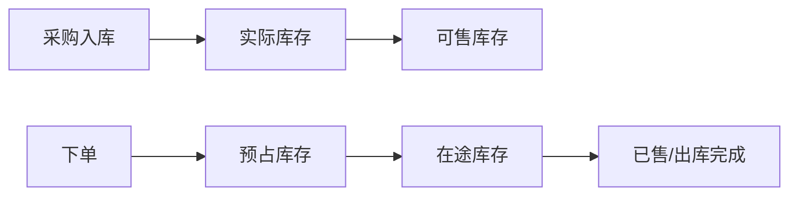

# 库存 / 商品（Inventory & SKU）

> 最近更新：2026-05-13（v0.1 骨架）

## 1. 这个模块管什么 / 不管什么

**管**：
- <待沉淀：SKU 体系（SPU / SKU / 变体）>
- <待沉淀：库存类型（实际 / 可售 / 预占 / 在途）>
- <待沉淀：仓库与库位>

**不管**：
- 采购入库前的供应商（见 `purchase.md`）
- 销售出库后的物流（见 `package.md`）

## 2. 核心实体

| 实体 | 关键字段 | 说明 |
|---|---|---|
| SPU | `spu_id`、`name`、`category` | <待沉淀> |
| SKU | `sku_id`、`spu_id`、`attributes` | <待沉淀> |
| Stock | `sku_id`、`warehouse_id`、`physical`、`available`、`reserved` | <待沉淀> |

## 3. 关键状态机

库存类型流转（不一定是状态机，可能是关系图）：

<待沉淀>

## 4. 业务规则

- <待沉淀>

## 5. 与其他模块的关系

- 上游：`purchase.md`（采购入库 → 实际库存增加）
- 下游：`order.md`（下单 → 预占库存）
- 下游：`package.md`（发货 → 实际库存扣减）

## 6. 常见误解 / 易混淆点

- <待沉淀，例如"可售库存 ≠ 实际库存 - 预占"，还有安全库存、超卖容差>

## 7. 历史决策

- <待补>

---

## 沉淀引导

- [ ] SPU / SKU / 变体的关系（一个 SPU 几个 SKU、变体维度）
- [ ] 库存类型完整定义（physical / available / reserved / in_transit / safety）
- [ ] 多仓策略（按渠道分仓？按地域分仓？）
- [ ] 库位（盘点单位）
- [ ] 预占库存释放规则（订单取消后多久释放）
- [ ] 安全库存 / 补货阈值
- [ ] 商品上下架对库存可售性的影响
