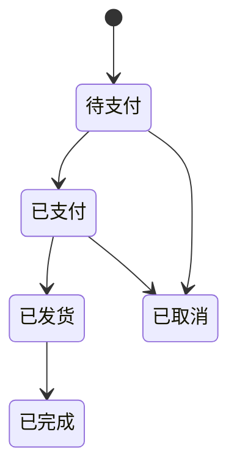

# 订单（Order）

> 最近更新：2026-05-13（v0.1 骨架）
>
> 已有的 `../order-package-flow.md` 包含部分订单相关内容，本文件以后会逐步把订单专题接管过来。

## 1. 这个模块管什么 / 不管什么

**管**：

- <待沉淀：订单生命周期>
- <待沉淀：订单核心字段>
- <待沉淀：订单状态机>

**不管**：

- 包裹（见 `package.md`）
- 退款（见 `refund.md`）
- 财务结算（见 `finance.md`）

## 2. 核心实体

| 实体 | 关键字段 | 说明 |
|---|---|---|
| Order | `order_id`、`channel`、`status`、`amount` | <待沉淀> |
| OrderItem | `order_id`、`sku_id`、`qty`、`unit_price` | <待沉淀> |

## 3. 关键状态机

<待沉淀：完整状态机含异常分支>

## 4. 业务规则

（每条独立成段 + 标注来源。例：）

- <待沉淀，例如"订单超过 30 分钟未支付自动取消并释放库存"（来源待补）>

## 5. 与其他模块的关系

- 下游：`package.md`（订单已支付后生成待发货包裹）
- 关联：`refund.md`（已支付订单可发起退款）
- 关联：`finance.md`（订单状态变更触发账务变动）

## 6. 常见误解 / 易混淆点

- <待沉淀，例如"订单取消 != 退款"——取消是状态变更，退款是 payment 模块的独立流程>

## 7. 历史决策

- <待补，链接到 `../decisions/YYYY-MM-DD-*.md`>

---

## 沉淀引导（给 Claude 看的提问清单）

下次涉及订单的需求过路时，从 PRD 里抽这些信息回填本文件：

- [ ] 订单状态总数 + 完整状态机（含异常分支）
- [ ] 订单号生成规则
- [ ] 订单超时策略（多少分钟未支付自动取消）
- [ ] 跨境订单的特殊字段（关税、币种、HS Code）
- [ ] 渠道字段（Amazon / eBay / Shopify / 独立站）的取值约束
- [ ] 订单合并 / 拆分规则
- [ ] 修改订单的限制（哪些字段可改、什么状态下可改、改了之后状态怎么变）
- [ ] 订单和包裹的对应关系（1:1 / 1:N / N:N）
