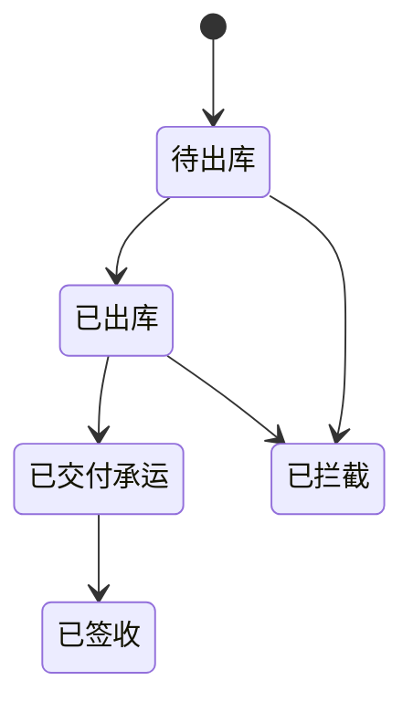

# 包裹（Package）

> 最近更新：2026-05-13（v0.1 骨架）

## 1. 这个模块管什么 / 不管什么

**管**：
- <待沉淀：包裹生成时机>
- <待沉淀：包裹状态机>
- <待沉淀：拦截 / 取消规则>

**不管**：
- 物流追踪明细（如有独立模块，待补）
- 订单本身（见 `order.md`）

## 2. 核心实体

| 实体 | 关键字段 | 说明 |
|---|---|---|
| Package | `package_id`、`order_id`、`status`、`tracking_no`、`carrier` | <待沉淀> |
| PackageItem | `package_id`、`sku_id`、`qty` | <待沉淀> |

## 3. 关键状态机

<待沉淀：完整状态机>

## 4. 业务规则

- <待沉淀>

## 5. 与其他模块的关系

- 上游：`order.md`（订单触发包裹生成）
- 关联：`inventory.md`（包裹出库扣减实际库存）
- 关联：`refund.md`（拦截成功的包裹关联退款流程）

## 6. 常见误解 / 易混淆点

- <待沉淀>

## 7. 历史决策

- <待补>

---

## 沉淀引导

- [ ] 包裹生成时机（订单已支付？已审核？人工触发？）
- [ ] 1 个订单 → 几个包裹（拆分规则）
- [ ] 拦截窗口（已出库后多久还能拦截）
- [ ] 拦截成功率 / 拦截失败兜底
- [ ] 多承运商对接（DHL / FedEx / UPS / 本地物流）
- [ ] 跨境清关相关字段
- [ ] 包裹和库存的扣减时机（下单扣 / 发货扣）
