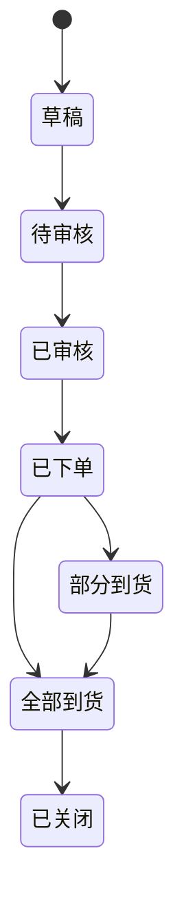

# 采购（Purchase）

> 最近更新：2026-05-13（v0.1 骨架）

## 1. 这个模块管什么 / 不管什么

**管**：
- <待沉淀：采购单生命周期>
- <待沉淀：供应商对接>
- <待沉淀：入库流程>

**不管**：
- 入库后的库存账（见 `inventory.md`）
- 应付款结算（见 `finance.md`）

## 2. 核心实体

| 实体 | 关键字段 | 说明 |
|---|---|---|
| PurchaseOrder | `po_id`、`supplier_id`、`status`、`expected_at` | <待沉淀> |
| PurchaseItem | `po_id`、`sku_id`、`qty`、`unit_cost` | <待沉淀> |
| Supplier | `supplier_id`、`name`、`payment_terms` | <待沉淀> |

## 3. 关键状态机

<待沉淀>

## 4. 业务规则

- <待沉淀>

## 5. 与其他模块的关系

- 下游：`inventory.md`（采购到货 → 实际库存增加）
- 关联：`finance.md`（应付款生成）

## 6. 常见误解 / 易混淆点

- <待沉淀>

## 7. 历史决策

- <待补>

---

## 沉淀引导

- [ ] 采购单完整状态机（含驳回、撤销）
- [ ] 审核流程（几级审核？金额阈值）
- [ ] 部分到货怎么处理（多次入库）
- [ ] 入库质检环节
- [ ] 与供应商系统对接（EDI / 接口 / 邮件）
- [ ] 采购退货 / 换货流程
- [ ] 采购成本算法（最近一次 / 加权 / FIFO）
