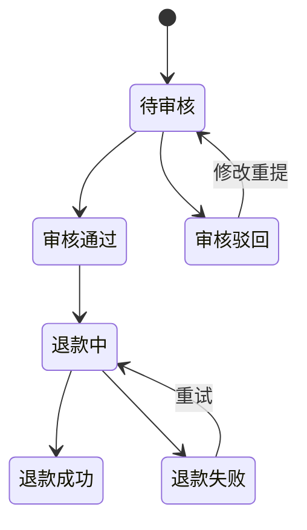

# 退款（Refund）

> 最近更新：2026-05-13（v0.1 骨架）
>
> 历史 case：`cases/refund-management/` 已有产出，**默认不读**——只有当本次需求与退款强相关时才参考。

## 1. 这个模块管什么 / 不管什么

**管**：
- <待沉淀：退款类型（仅退款 / 退货退款 / 部分退款）>
- <待沉淀：退款审批链>
- <待沉淀：资金回流路径>

**不管**：
- 订单本身的取消（见 `order.md`，"已取消"是订单状态变更，退款是独立资金动作）
- 包裹拦截（见 `package.md`，拦截成功后可触发退款，但拦截本身是包裹模块的事）

## 2. 核心实体

| 实体 | 关键字段 | 说明 |
|---|---|---|
| Refund | `refund_id`、`order_id`、`type`、`amount`、`status`、`reason` | <待沉淀> |
| RefundItem | `refund_id`、`order_item_id`、`qty`、`amount` | <待沉淀> |
| RefundAudit | `refund_id`、`level`、`auditor`、`decision`、`comment` | <待沉淀> |

## 3. 关键状态机

<待沉淀>

## 4. 业务规则

- <待沉淀>

## 5. 与其他模块的关系

- 上游：`order.md`（已支付订单可发起退款）
- 关联：`package.md`（退货退款需关联包裹拦截 / 退回）
- 关联：`inventory.md`（退货退款回库）
- 关联：`finance.md`（实际资金回流）

## 6. 常见误解 / 易混淆点

- <待沉淀，例如"取消订单 ≠ 退款"，"全额退款" vs "部分退款"，"退款" vs "退货">

## 7. 历史决策

- <待补，参考 `cases/refund-management/`>

---

## 沉淀引导

- [ ] 退款类型完整枚举
- [ ] 审批等级（金额阈值触发几级）
- [ ] 各角色权限（客服 / 主管 / 财务）
- [ ] 退款时效 SLA
- [ ] 资金回流路径（原路 / 余额 / 代金券）
- [ ] 退款失败重试策略
- [ ] 与平台规则联动（Amazon A-Z claim / eBay INR 等）
