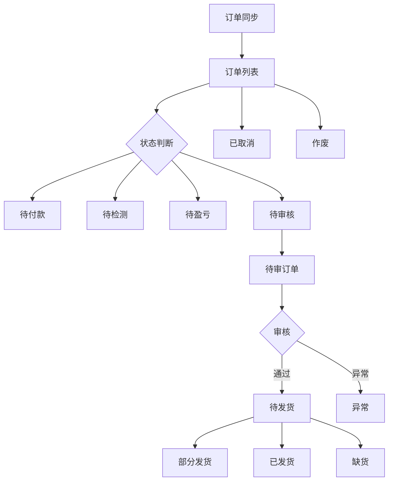
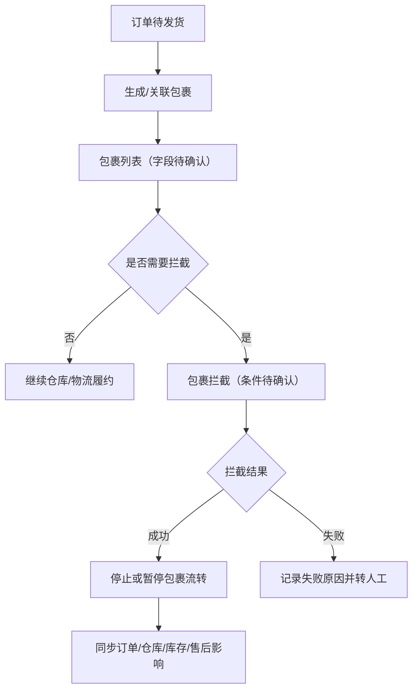

# Order Package Flow Knowledge

> 面向后续 AI agent 使用。更新时间：2026-05-07。
> 来源：本地项目知识库规则、测试环境 ERP 已观察页面、测试环境空响应记录。
> 禁止把登录密码、token、内部账号信息写入后续输出。

## AI 使用摘要

- 系统是跨境电商自研 ERP 的订单系统，UI 属于中文 B 端后台。
- 重点入口：`订单管理 > 订单列表`、`订单管理 > 待审订单`、`包裹管理 > 包裹列表`、`包裹管理 > 包裹拦截`。
- 订单列表是订单全量查询和批量处理主入口；待审订单是集中审核入口。
- 订单列表已确认状态页签：全部、待付款、待检测、待盈亏、待审核、待发货、部分发货、已发货、已取消、异常、可合并、缺货、作废。
- 包裹列表和包裹拦截菜单已确认存在，但页面字段因测试环境 OMS 空响应未完成复核。
- 后续 AI 输出必须区分 `已确认事实`、`合理推断`、`待确认问题`，不得编造包裹拦截规则。

## 已确认事实

### 系统与菜单

- 系统门户中存在 `订单管理 / OMS 订单管理` 入口。
- 左侧订单系统菜单包含订单-首页、库存管理、调拨管理、订单管理、销售看板、SMT仓发接单列表、订单报表、包裹管理、基础配置、运营管理。
- `订单管理` 展开后包含：订单列表、待审订单、退款订单、异常订单、退款订单、SKU映射、运费试算、产品资料库、退件列表、退件认领列表。
- `包裹管理` 展开后包含：包裹列表、包裹拦截。

### 订单列表

- 路径：`/yh-oms/omsList`。
- 基础筛选：单号类型、关键词、平台、店铺、站点。
- 基础按钮：搜索、高级筛选、重置、常用搜索。
- 主要操作按钮：手工订单、操作订单、批量处理、批量操作包裹、下载订单、数据导出、订单任务、异常处理、批量复制、SKU映射、匹配规则。
- 表格列：订单信息、产品信息、费用信息、包裹信息、时间。
- 高级筛选包含时间、金额、利润、系统标签、部门、订单类型、订单来源、仓库、包裹状态、物流渠道、买家信息、备注、异常等多类条件。

### 待审订单

- 路径：`/yh-oms/toBeReviewed`。
- 基础筛选：单号类型、关键词、平台、店铺、站点。
- 操作按钮：一键审核、批量提交审核、数据导出。
- 表格列：平台订单信息、产品信息、费用信息、发货信息、操作。

### 测试环境状态

- 2026-05-07 调研时，`omsList`、`toBeReviewed`、`omsPackage`、`interception` 四个 OMS 业务路径均出现可连接但 HTTP 无业务响应/超时。
- 订单列表和待审订单的部分页面信息来自此前已加载的 Chrome 页面和截图。
- 包裹列表和包裹拦截只确认菜单与路径，未确认页面字段。

## 合理推断

- 订单主链路大概率是：平台订单同步 -> 订单列表 -> 检测/盈亏/审核 -> 待发货 -> 生成包裹 -> 发货 -> 已发货或异常。
- 订单列表中的 `待审核` 状态页签与独立 `待审订单` 页面服务于同一审核链路，但页面目标不同：前者是全量列表筛选，后者是集中审核工作台。
- `包裹信息` 列、`批量操作包裹` 按钮和 `包裹管理` 菜单说明订单与包裹存在明确关联。
- 包裹列表通常承接包裹查询、物流渠道、跟踪号、仓库处理、发货状态与异常查看。
- 包裹拦截通常需要检查包裹是否已出库、已交运、已发货，以及仓库/物流是否支持拦截。
- 包裹拦截成功后可能影响订单状态、仓库作业、库存释放、退款或售后处理。

## 订单、库存、仓储、物流、包裹、异常、退款关系

| 对象 | 与订单流程关系 | 当前确认度 |
|------|----------------|------------|
| 订单 | 主业务对象，承载平台订单、商品、费用、包裹和时间信息 | 已确认 |
| 库存 | 影响待发货、缺货、仓库处理 | 推断 |
| 仓储 | 承接扫描、打包、发货仓库、出库 | 推断，字段已在高级筛选中出现 |
| 物流 | 承接平台配送方式、物流渠道、跟踪号有效期 | 推断，字段已在高级筛选中出现 |
| 包裹 | 订单履约载体，订单列表已出现包裹信息列 | 已确认存在，细节待确认 |
| 异常 | 订单列表有异常状态页签和异常处理按钮 | 已确认入口，规则待确认 |
| 退款 | 订单管理菜单存在退款订单，可能与取消、异常、拦截有关 | 已确认入口，联动待确认 |

## 订单状态流转

## 包裹状态与拦截逻辑

## 页面字段与按钮含义

### 订单列表

| 类别 | 字段/按钮 | 含义 |
|------|-----------|------|
| 筛选 | 平台单号、平台、店铺、站点 | 定位订单来源和范围 |
| 筛选 | 高级筛选 | 多条件组合查询 |
| 状态 | 待付款、待检测、待盈亏、待审核、待发货等 | 订单处理阶段 |
| 操作 | 批量处理、批量操作包裹 | 批量改变订单或包裹相关状态 |
| 操作 | 异常处理 | 处理订单异常 |
| 操作 | SKU映射、匹配规则 | 影响平台商品与系统 SKU 的匹配 |

### 待审订单

| 类别 | 字段/按钮 | 含义 |
|------|-----------|------|
| 筛选 | 平台单号、平台、店铺、站点 | 定位待审订单 |
| 操作 | 一键审核 | 快速审核符合条件的订单 |
| 操作 | 批量提交审核 | 批量推进审核 |
| 表格 | 平台订单信息、产品信息、费用信息、发货信息 | 审核前核对的核心信息 |

## 关键业务规则

### 已确认

- 高风险操作集中在批量处理、批量操作包裹、异常处理、审核、拦截等入口。
- 文档和知识库不得记录密码、token 或内部账号信息。
- 不确定内容必须标记为待确认，不能写成事实。

### 合理推断

- 审核通过后订单进入待发货或后续履约阶段。
- 缺货、异常、作废、取消会中断或改变正常履约流程。
- 包裹拦截需要检查包裹所处仓储/物流阶段。

### 待确认

- 订单详情页字段、入口和抽屉/页面形式。
- 单条审核弹窗字段、审核通过/驳回规则。
- 批量审核、批量处理和异常处理的二次确认机制。
- 包裹列表字段、状态、操作和详情页。
- 包裹拦截条件、结果状态、失败原因和后置影响。
- 订单与库存、仓储、物流、退款之间的真实系统联动。

## 操作风险等级

| 等级 | 说明 | 示例 |
|------|------|------|
| 只读 | 不改变数据 | 搜索、筛选、查看 |
| 低风险 | 影响轻、可恢复或仅导出 | 常用搜索、复制、普通导出 |
| 中风险 | 单条改变状态或影响匹配规则 | 单条审核、异常处理、SKU映射、匹配规则 |
| 高风险 | 批量改变状态或影响仓储物流售后 | 批量审核、批量处理、批量操作包裹、包裹拦截、作废、删除、扣费、提现 |

## 后续 AI 使用规则

- 如果用户让继续调研包裹页面，先确认 OMS 服务是否恢复，再进入 `包裹列表` 和 `包裹拦截`。
- 输出方案或 PRD 时，订单列表和待审订单可作为已确认页面基础；包裹页面必须标注待确认，除非新截图已复核。
- 涉及批量、拦截、作废、删除、扣费、提现时，必须提醒风险、前置条件、二次确认和后置检查。
