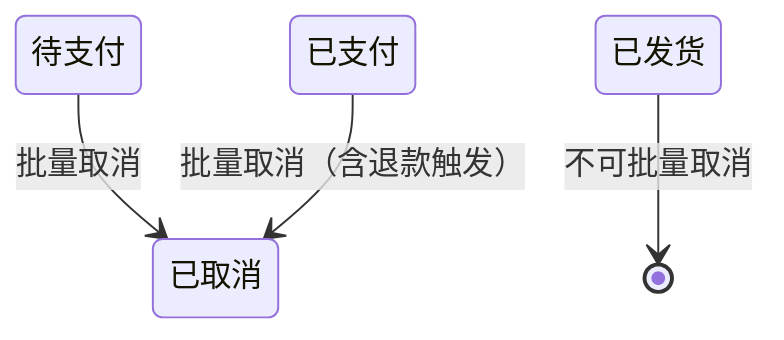

# 范例 PRD · 订单批量取消

> **本文件作用**：
>
> 1. 给 Claude 看 —— 这是 freddy 想要的 PRD **风格示范**。以后写新 PRD 都按这个口味
> 2. 给 Codex 看 —— 第 8 节"原型生成输入包"是完整的输入示范
>
> **不是真实需求**——里面所有业务规则都标 `<假设>` 或 `<待确认>`，仅作示范，不要按本文件直接落地。

---

## 1. 背景与目标

### 1.1 背景

现状：客服日均处理 200+ 单"用户主动取消"，目前只能逐条点。

痛点：

- 单条取消平均 30 秒（找单 + 确认 + 释放库存 + 退款触发）
- 旺季每天耗费 1.5 小时纯重复劳动
- 高峰时段处理不过来，平台超时风险

不做的代价：旺季客服扩招 1 人/季 = ¥30K，且响应时长不达 SLA。<待确认：数字>

### 1.2 目标

- 业务目标：批量取消让 200 单处理时间从 100 分钟降到 5 分钟（≥ 95% 节省）
- 用户目标：客服一次最多选 50 单批量取消，包含可见进度反馈
- 北极星指标：取消订单的"客服人工时长"日均值（min/单）

### 1.3 非目标

- 不做"自动取消规则引擎"——只做手动批量
- 不做"取消后改派"——客服走完取消，后续问题独立处理
- 不改变单条取消现有交互——加并不删

## 2. 用户与场景

### 2.1 目标用户

| 角色 | 主要任务 | 频率 | 备注 |
|---|---|---|---|
| 客服 | 用户咨询后批量取消 | 日 50-200 单 | 主要使用者 |
| 主管 | 大额订单需主管审 | 日 5-20 单 | 大额单需要二级确认 |
| 财务（只读） | 对账 | 周 1 次 | 只看不操作 |

### 2.2 用户故事

- 作为**客服**，我希望**一次选中多条订单批量取消**，以便**旺季 5 分钟处理掉一上午的取消请求**。
- 作为**主管**，我希望**大额订单的批量取消需要我二次确认**，以便**避免误操作造成大额资金问题**。

### 2.3 典型场景

旺季 10:00-12:00，客服小张接到 50+ 用户取消请求。

旧流程：找单 → 单条点取消 → Popconfirm → 等接口 → 下一条，30 秒/单 = 25 分钟。

新流程：表头搜"用户主动取消"标签 → 全选 → 点"批量取消" → Modal 二次确认含金额汇总 → 提交 → 进度条 5 分钟内完成。

## 3. 功能范围

### 3.1 功能清单

| ID | 功能名 | 优先级 | 备注 |
|---|---|---|---|
| F1 | 批量取消订单 | P0 | 含 50 单/批的上限 |
| F2 | 取消前置校验 + 金额汇总 | P0 | 大额走主管审 |
| F3 | 批量执行进度反馈 | P0 | 含部分成功/部分失败 |
| F4 | 取消原因必填 | P1 | 5 种枚举 + 其他 |

### 3.2 主流程

```mermaid
flowchart LR
  A[订单列表勾选] --> B[点"批量取消"]
  B --> C{是否有大额单?}
  C -- 是 --> D[主管审]
  C -- 否 --> E[Modal 含金额汇总]
  D --> E
  E --> F{用户确认?}
  F -- 取消 --> A
  F -- 确认 --> G[选取消原因]
  G --> H[提交后端]
  H --> I[进度条]
  I --> J[结果 Result + 部分失败明细]
```

### 3.3 逆向 / 异常流程

- 取消失败的单：列出明细 + 失败原因 + 重试入口
- 网络中断：本地暂存请求，恢复后弹窗"继续提交" / "丢弃"
- 用户在执行过程中关闭浏览器：后端继续执行；下次进入页面 Toast 提示结果

## 4. 页面清单

| 页面 ID | 页面名称 | 用户入口 | 主任务 | 涉及功能 |
|---|---|---|---|---|
| P1 | 订单列表（现有页 + 批量条增强） | 侧栏「订单 / 订单列表」 | 查找、勾选、批量操作 | F1, F2 |
| P2 | 批量取消确认弹窗 | P1 批量条 → "批量取消" | 二次确认 + 金额汇总 + 原因 | F2, F4 |
| P3 | 执行进度抽屉 | P2 确认后自动打开 | 进度反馈 + 结果展示 | F3 |

> **注**：本次只增强 P1，新增 P2/P3。**不新增独立页**。

## 5. 功能说明

### 5.1 批量取消订单（F1）

- **用户价值**：客服一次处理 50 单只需 5 分钟（vs 旧流程 25 分钟）
- **触发条件**：
  - 用户角色为 `客服` 或 `主管`
  - 至少勾选 1 条订单
  - 勾选订单状态在 `{待支付, 已支付}` 内 <假设>
- **主流程**：见 §3.2
- **异常流程**：
  - 勾选了不可取消状态的订单 → 批量条出现警告条 + 高亮异常行 + 提示"已自动剔除 N 条不可取消订单"
  - 单批超过 50 单 → 禁用"批量取消"按钮 + tooltip "单批最多 50 单"
- **权限影响**：
  - 客服：单订单 ≤ ¥5,000 直接取消；> ¥5,000 提示"需主管审批" <假设>
  - 主管：所有金额都可
- **页面影响**：P1 的批量条新增"批量取消"按钮（红色 `btn--danger`）
- **状态变化**：勾选订单状态从 `待支付/已支付` → `已取消`
- **是否支持撤回**：❌ 不支持。文案"已取消订单不可恢复，库存自动释放"



- **验收标准**：
  - [ ] 勾选含异常状态订单时，按钮可点但提示"将自动剔除 N 条"
  - [ ] 50 单批量取消端到端 < 30 秒
  - [ ] 部分失败时，成功的入库 / 退款已触发，失败的保持原状态

### 5.2 取消前置校验 + 金额汇总（F2）

- **用户价值**：让客服点确认前看到完整影响范围，避免误操作
- **触发条件**：点"批量取消"按钮后立即触发
- **主流程**：前端汇总（不调后端）→ 弹 Modal 展示
- **展示内容**（Modal）：
  - 单数（含可取消 N / 总勾选 M）
  - 总金额 + 涉及币种
  - 含已支付的单数（会触发退款）
  - 大额订单清单（金额 > ¥5,000）
- **异常**：所有单都不可取消时，按钮禁用 + 直接 Toast
- **权限**：大额单仅主管确认；客服遇到大额必须升级 <假设>
- **验收**：
  - [ ] 金额汇总误差 = 0
  - [ ] 大额订单红色标记可见

### 5.3 批量执行进度反馈（F3）

- **用户价值**：50 单需要 20 秒处理，进度反馈让客服安心、不重复点
- **触发条件**：用户在 Modal 确认后
- **主流程**：
  1. Modal 关闭
  2. DetailDrawer 打开，标题"批量取消进度"
  3. 进度条 + 实时滚动的单据流
  4. 完成后显示 Result（成功 X / 失败 Y） + 失败明细表
- **异常**：
  - 网络断 → 进度暂停 + "网络异常，自动重试中…"
  - 后端超时（> 30s）→ 任务转后台，DetailDrawer 提示"任务已转后台，可关闭，完成后通知"
- **权限**：当前操作人可见，其他用户不可见
- **验收**：
  - [ ] 进度条数字与实际进度一致
  - [ ] 关闭抽屉再打开能恢复进度

### 5.4 取消原因必填（F4）

- **用户价值**：让后续运营分析"用户为什么取消"
- **触发条件**：Modal 二次确认时
- **枚举**：
  - 用户主动取消
  - 缺货
  - 地址有误
  - 风控拦截
  - 其他（需填备注）
- **校验**：必选；"其他"必填备注 ≥ 10 字
- **状态**：原因和备注存在 `Order.cancel_reason` 字段（<待确认：是否扩展现有字段>）

## 6. 页面说明

### 6.1 P1 订单列表（增强）

- **页面目标**：查找、勾选、批量操作订单（在现有基础上增加批量取消按钮）
- **用户入口**：侧栏「订单 / 订单列表」
- **页面结构**：
  - **标题区**：现有不变（"+ 新建订单"主操作保留）
  - **筛选区**：现有不变（订单号搜索 / 状态 / 渠道 / 时间）
  - **结果区**：现有 DataTablePanel + 增强 BatchActionBar
  - **抽屉**：现有 DetailDrawer 单条详情 + 新增 P3 批量取消进度抽屉
- **核心操作**：勾选 → BatchActionBar 中"批量取消"
- **权限差异**：
  - 客服 / 主管 / 财务 都能看
  - "批量取消"按钮仅 客服 / 主管 可见
- **校验与反馈**：勾选超过 50 单时按钮禁用 + tooltip
- **状态说明**：现有 8 态全保留
- **边界情况**：勾选含已发货等不可取消状态 → 按钮可点但提示自动剔除

### 6.2 P2 批量取消确认弹窗

- **页面目标**：二次确认 + 展示影响范围
- **用户入口**：P1 批量条 → "批量取消"
- **页面结构**（Modal）：
  - **顶部摘要**：可取消 N / 总勾选 M、总金额、含已支付 X 单（红色提示）
  - **大额订单清单**（条件展示）：表格列出 > ¥5,000 单
  - **原因选择**：Radio.Group
  - **备注**（条件展示，选"其他"时）：textarea
  - **底部**：取消 / 确认（`btn--danger`）
- **核心操作**：选原因 → 点确认
- **权限差异**：大额订单存在时，客服角色按钮文案为"提交给主管审"；主管为"确认取消"
- **校验**：原因必选；"其他"备注 ≥ 10 字 → 按钮禁用 + 字段红框
- **状态**：默认 / 校验失败 / 提交中（btn loading）
- **边界**：勾选 0 条可取消时，Modal 不弹，直接 Toast "无可取消订单"

### 6.3 P3 批量取消进度抽屉

- **页面目标**：进度反馈 + 结果展示
- **用户入口**：P2 确认后自动打开
- **页面结构**（DetailDrawer）：
  - **头部**：标题"批量取消进度" + 关闭 ×
  - **进度块**：进度条 + 文案"X / N 已完成"
  - **滚动单据流**：每完成 1 单滚动展示
  - **完成区**（条件展示）：Result 风格 + 失败明细表 + 重试按钮
- **核心操作**：等待 / 关闭 / 重试失败项
- **权限差异**：仅操作人可见
- **校验与反馈**：完成后 Notification 跨页提醒
- **状态**：进行中 / 已完成（全成）/ 已完成（部分失败）/ 网络异常
- **边界**：用户关闭抽屉后不影响后端任务；下次进入 P1 时 Toast 提示结果

## 7. 风险与未决问题

| 风险 / 未决 | 影响 | 当前策略 | 待澄清 |
|---|---|---|---|
| 大额阈值 ¥5,000 | 决定升级率 | 假设 | <待确认：实际阈值> |
| 已发货订单能否纳入"拦截+取消" | 影响 F1 状态机 | 暂不支持 | <待确认：是否扩展> |
| 取消原因字段是新建还是复用 | 影响数据库 | 假设复用 `cancel_reason` | <待确认：现有字段名> |
| 后台任务转后台后的回流通知形式 | 影响 P3 | 假设 Notification | <待确认：是否需要邮件/短信> |

---

## 8. 原型生成输入包（Codex 消费）

### 8.1 必读引用

```yaml
figma:
  fileKey: KaI3eGyylfiwrPlU3OR08C
  page_to_use: "03 Components / ERP Patterns"
  preferred_template: ListPageTemplate  # P1 复用；P2/P3 用 Modal + Drawer 拼

html_mirror:
  tokens_css: ../ui-library/tokens.css
  components_dir: ../ui-library/components/

specs:
  - knowledge/figma-ant-design-ui-library.md
  - knowledge/product-design-preferences.md
  - knowledge/prd-style-anchor.md
  - skills/erp-product-manager/references/ui-interaction-spec.md
  - skills/erp-product-manager/references/erp-reference-patterns.md
  - skills/ui-optimization-master/references/erp-ui-pattern-library.md
```

### 8.2 页面清单

| 页面 ID | 页面名 | 路径建议 | 模板 | 抽屉 / 弹窗 |
|---|---|---|---|---|
| P1 | 订单列表（增强批量条） | `/orders/list` | ListPageTemplate | 现有 DetailDrawer + 新增 P3 |
| P2 | 批量取消确认弹窗 | （Modal，无路径） | CreateModal 改造 | — |
| P3 | 批量取消进度抽屉 | （Drawer，无路径） | DetailDrawer 改造 | — |

### 8.3 组件映射表

| 页面 | 区域 | Figma 组件 | HTML 镜像 | Notes |
|---|---|---|---|---|
| P1 | 壳层 | ErpShell | components/erp-shell.html | 现有不变 |
| P1 | 标题区 | PageHeaderBar | components/page-header-bar.html | 现有不变 |
| P1 | 筛选区 | QueryFilterBar | components/query-filter-bar.html | 现有不变 |
| P1 | 结果区 | DataTablePanel | components/data-table-panel.html | 已含 BatchActionBar；新增"批量取消"按钮（`btn--danger`） |
| P1 | 单条详情 | DetailDrawer | components/detail-drawer.html | 现有不变 |
| P2 | 确认弹窗 | Modal + Form + Table | （HTML 镜像 v0.2 待补，暂用 Ant Design Modal 直接拼） | 大额订单清单用 Table 嵌套 |
| P3 | 进度抽屉 | DetailDrawer | components/detail-drawer.html | 改造：替换 Tabs 为单一进度区 + Timeline 单据流 |

### 8.4 状态覆盖矩阵

| 页面 | 默认 | 加载 | 空 | 筛选无结果 | 错误 | 成功反馈 | 禁用 | 无权限 |
|---|---|---|---|---|---|---|---|---|
| P1 | 必 | 必 | 必 | 必 | 必 | 必 | 必 | 必 |
| P2 | 必 | 必（提交中）| 不适 | 不适 | 必 | 不适 | 必（校验前）| 必 |
| P3 | 必 | 必 | 不适 | 不适 | 必（网络/超时）| 必（全成 + 部分失败）| 不适 | 必 |

### 8.5 风险操作清单

| 动作 | 触发位置 | 风险等级 | 二次确认形式 | 文案 |
|---|---|---|---|---|
| 单条取消（现有） | 行操作 | 中 | Popconfirm | "取消订单 O-XXX？库存自动释放，不可撤回。" |
| 批量取消（新增）| P1 批量条 | **高** | Modal.confirm（即 P2） | "将取消 N 单订单，涉及 ¥X 金额，含 X 条已支付单将触发退款。**不可撤回**。" |
| 重试失败项 | P3 完成区 | 中 | Popconfirm | "重试 X 单失败订单的取消操作？" |

### 8.6 权限差异表

| 角色 | 进入 P1 | 看到批量取消按钮 | 可操作 | 备注 |
|---|---|---|---|---|
| 客服 | ✅ | ✅ | 单订单 ≤ ¥5,000 直接；> ¥5,000 升级主管 | 大额时按钮文案变"提交给主管审" |
| 主管 | ✅ | ✅ | 所有金额 | 按钮文案"确认取消" |
| 财务（只读）| ✅ | ❌ | — | 整个 BatchActionBar 不显示 |
| 仓储 | ❌ | — | — | 看不到订单菜单 |

### 8.7 Mock 数据样本

```json
[
  {"id": "O-20260512-000001", "user": "张三", "channel": "Amazon US", "status": "已支付", "amount": 1280.00, "currency": "USD", "ts": "2026-05-12 10:23"},
  {"id": "O-20260512-000002", "user": "李四", "channel": "eBay UK",   "status": "待支付", "amount":  580.00, "currency": "GBP", "ts": "2026-05-12 11:02"},
  {"id": "O-20260511-000098", "user": "王五", "channel": "Shopify",   "status": "已支付", "amount": 6200.00, "currency": "USD", "ts": "2026-05-11 17:48"},
  {"id": "O-20260511-000097", "user": "赵六", "channel": "Amazon DE", "status": "已完成", "amount":  199.00, "currency": "EUR", "ts": "2026-05-11 09:11"},
  {"id": "O-20260510-000044", "user": "钱七", "channel": "独立站",    "status": "已发货", "amount":  860.00, "currency": "USD", "ts": "2026-05-10 14:30"},
  {"id": "O-20260512-000003", "user": "孙八", "channel": "Amazon US", "status": "已支付", "amount":  450.00, "currency": "USD", "ts": "2026-05-12 12:15"},
  {"id": "O-20260512-000004", "user": "周九", "channel": "Amazon US", "status": "已支付", "amount": 9800.00, "currency": "USD", "ts": "2026-05-12 13:02"}
]
```

取消原因枚举（Codex 直接用）：

```json
[
  {"value": "USER_INITIATED", "label": "用户主动取消"},
  {"value": "OUT_OF_STOCK",   "label": "缺货"},
  {"value": "WRONG_ADDRESS",  "label": "地址有误"},
  {"value": "RISK_BLOCKED",   "label": "风控拦截"},
  {"value": "OTHER",          "label": "其他（需填备注 ≥ 10 字）"}
]
```

进度反馈样本：

```json
{
  "total": 50,
  "completed": 38,
  "failed": 2,
  "in_progress_id": "O-20260512-000038",
  "fail_samples": [
    {"id": "O-20260512-000033", "reason": "订单已签收，不可取消"},
    {"id": "O-20260512-000041", "reason": "退款通道异常"}
  ]
}
```

---

> 生成于 2026-05-13，by Claude × freddy（作为范例 PRD 写作示范，不作为实际需求）
