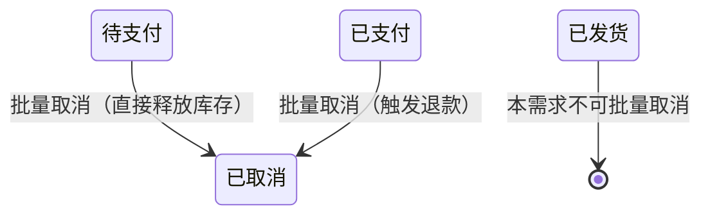

# 范例 PRD · 订单批量取消（合并版 9+1 节）

> **本文件作用**：
> 1. 给 Claude 看 —— freddy 的 PRD **风格示范**。新需求开场参考这个口味
> 2. 给 Codex / 原型生成方看 —— 第 10 节"原型生成输入包"是完整输入示范
>
> **不是真实需求**——所有业务规则标 `<假设>` / `<待确认>`，仅作示范。

---

## 1. 背景与目标

### 1.1 背景

现状：客服日均处理 200+ 单"用户主动取消"，目前只能逐条点。

痛点：

- 单条取消 30 秒（找单 + 确认 + 释放库存 + 退款触发）
- 旺季每天耗费 1.5 小时纯重复劳动
- 高峰时段处理不过来，平台超时风险

不做的代价：旺季客服扩招 1 人 / 季 = ¥30K，且响应时长不达 SLA。 <待确认：数字>

### 1.2 目标

- **业务目标**：200 单处理时间从 100 分钟降到 5 分钟（≥ 95% 节省）
- **用户目标**：客服一次最多选 50 单批量取消，含可见进度反馈
- **北极星指标**：取消订单的"客服人工时长"日均值（min / 单），口径=`prom: cancel_duration_seconds / cancel_count`

### 1.3 非目标

- 不做"自动取消规则引擎"——只做手动批量
- 不做"取消后改派"——客服走完取消，后续独立处理
- 不改变单条取消现有交互——加并不删

## 2. 用户与场景

### 2.1 目标用户

| 角色 | 主要任务 | 频率 | 备注 |
|---|---|---|---|
| 客服 | 用户咨询后批量取消 | 日 50-200 单 | 主要使用者 |
| 主管 | 大额订单需主管审 | 日 5-20 单 | 大额单需二级确认 |
| 财务（只读） | 对账 | 周 1 次 | 只看不操作 |

### 2.2 用户故事

- 作为**客服**，我希望**一次选中多条订单批量取消**，以便**旺季 5 分钟处理掉一上午的取消请求**。
- 作为**主管**，我希望**大额订单的批量取消需要我二次确认**，以便**避免误操作造成大额资金问题**。

### 2.3 典型场景

旺季 10:00-12:00，客服小张接到 50+ 用户取消请求。

旧流程：找单 → 单条点取消 → Popconfirm → 等接口 → 下一条，30 秒 / 单 = 25 分钟。

新流程：表头搜"用户主动取消"标签 → 全选 → 点"批量取消" → Modal 二次确认含金额汇总 → 提交 → 进度条 5 分钟内完成。

## 3. 业务流程与状态机

### 3.1 主流程

```mermaid
flowchart LR
  A[订单列表勾选] --> B[点"批量取消"]
  B --> C{是否有大额单?}
  C -- 是 --> D[主管审]
  C -- 否 --> E[Modal 含金额汇总]
  D --> E
  E --> F{用户确认?}
  F -- 取消 --> A
  F -- 确认 --> G[选取消原因]
  G --> H[提交后端]
  H --> I[进度条]
  I --> J[结果 Result + 部分失败明细]
```

### 3.2 订单状态机（本需求涉及部分）



**触发权限**：客服（≤¥5,000） / 主管（任意金额）。

### 3.3 逆向 / 异常流程

- 取消失败：列出明细 + 失败原因 + 重试入口
- 网络中断：本地暂存请求，恢复后弹窗"继续提交" / "丢弃"
- 用户中途关浏览器：后端继续；下次进入页面 Toast 提示

## 4. 功能详述

### 4.A 批量取消订单

#### 4.1 功能定义

| 优先级 | 角色 | 功能点 | 触发条件 | 前置条件 |
|---|---|---|---|---|
| P0 | 客服 / 主管 | 一次选择 ≤50 条订单批量取消 | 点击"批量取消"按钮 | 至少勾选 1 条且状态 ∈ {待支付, 已支付} |

#### 4.2 字段取值逻辑

| 字段名 | 类型 | 必填 | 默认 | 校验 | 枚举 | 逻辑描述 |
|---|---|---|---|---|---|---|
| `cancel_reason` | enum | ✅ | — | 必选 | USER_INITIATED / OUT_OF_STOCK / WRONG_ADDRESS / RISK_BLOCKED / OTHER | 其中 OTHER 必须配 `cancel_note` |
| `cancel_note` | string | 当 reason=OTHER 时 ✅ | "" | 长度 ≥ 10 字符 | — | "其他"原因的补充说明 |
| `selected_ids` | array<string> | ✅ | — | 1 ≤ length ≤ 50 | — | 勾选的订单号集合 |
| `operator_id` | string | ✅ | session 内 | 必为登录用户 | — | 操作人，后端从 token 取 |

#### 4.3 交互说明

| 场景 | Ant Design 组件 | 触发动作 | 前端交互 | 后端逻辑 | 错误处理 |
|---|---|---|---|---|---|
| 勾选 | `Table` 行 `Checkbox` | 勾选 | 实时显示 BatchActionBar；超 50 单时按钮 `disabled` + Tooltip | — | — |
| 点"批量取消" | `Button` (color=danger, variant=outlined) | 点击 | 弹 `Modal` 含金额汇总 | 前端汇总（不调后端） | — |
| Modal 确认 | `Modal` + `Radio.Group` + `Input.TextArea` | 选原因 + 确认 | 校验原因；POST `/api/orders/batch-cancel` | 事务批量 update status；触发退款异步任务 | 部分失败：返回 `{ success: [], failed: [{ id, reason }] }` |
| 进度反馈 | `Drawer` + `Progress` + `Timeline` + `Result` | Modal 关闭后自动打开 | WebSocket / 轮询拉进度 | 后端推进 / 拉取 | 网络断 → 暂停 + "自动重试中…" |

#### 4.4 功能阐述（正向 / 异常路径）

| 路径 | 步骤 | 系统行为 | 用户感知 |
|---|---|---|---|
| 正向 | 1. 勾选 N 单（N ≤ 50） | BatchActionBar 出现，含"批量取消"按钮 | 看到选中数 |
| 正向 | 2. 点"批量取消" | 前端汇总，弹 Modal | Modal 展示可取消 N / 总 M、总金额、含已支付 X 单 |
| 正向 | 3. 选原因 + 确认 | Modal 关闭 → Drawer 自动打开 | 进度条 0/N |
| 正向 | 4. 进度滚动 | 单据流实时更新 | 看到处理进度 |
| 正向 | 5. 全部完成 | Result 显示"全部成功"，关闭 Drawer | Message 提示 |
| 异常 | 勾选含已发货单 | 按钮可点，但 Modal 顶部提示"已自动剔除 N 条不可取消订单" | 警示条 |
| 异常 | 单批 > 50 | 按钮 `disabled` + Tooltip "单批最多 50 单" | 灰按钮 + Tooltip |
| 异常 | 后端超时 > 30s | 任务转后台，Drawer 提示"任务已转后台，可关闭，完成后通知" | Notification 完成时跨页提醒 |

#### 4.5 逆向流程搭建

| 逆向场景 | 触发角色 | 触发条件 | 数据影响 | 状态回退规则 | 限制条件 |
|---|---|---|---|---|---|
| 失败项重试 | 操作人 | Drawer 显示部分失败后 | 仅对失败 id 重试 | 状态不回退，只对失败项再次尝试 | 重试上限 3 次 / 单 |

> **注**：本需求不涉及"取消后撤销"——已取消状态终态，不可逆。

#### 4.6 功能权限清单

| 角色 | 页面权限 | 按钮权限 | 字段权限 | 数据范围 | 审批 / 二次确认 |
|---|---|---|---|---|---|
| 客服 | 可见 | 单订单 ≤ ¥5,000 可点；> ¥5,000 按钮文案变"提交给主管审" | 全部可见 | 本店铺订单 | 大额走主管异步审 |
| 主管 | 可见 | 全金额可点 | 全部可见 | 全店铺 | 直接确认 |
| 财务（只读） | 可见 | "批量取消"按钮 **不显示** | 全部可见 | 全店铺只读 | — |
| 仓储 | 不可见（订单菜单本身就没权限） | — | — | — | — |

#### 4.7 上线前历史数据处理

| 数据对象 | 数据来源 | 是否迁移 | 处理 |
|---|---|---|---|
| — | — | — | 本次不涉及（纯前端 + 新接口，无历史数据需要洗） |

## 5. 埋点与可观测性

| 事件名 | 触发时机 | 携带参数 | 用途 |
|---|---|---|---|
| `batch_cancel_open` | 点"批量取消"按钮 | `selected_count`、`total_amount`、`has_large` | 衡量功能使用率 |
| `batch_cancel_confirm` | Modal 确认 | `final_count`、`reason`、`role` | 衡量原因分布 |
| `batch_cancel_done` | 全部完成 | `success_count`、`failed_count`、`duration_ms` | 衡量 SLA |
| `batch_cancel_fail_item` | 单项失败 | `order_id`、`fail_reason` | 失败模式分析 |

## 6. 风险、合规与性能要求

| 维度 | 要求 | 备注 |
|---|---|---|
| 并发 | 单操作人同时只能 1 个批量任务 | 后端 lock by `operator_id` |
| 延迟 | 50 单端到端 < 30s P95 | 退款异步触发不计入 |
| 数据脱敏 | Drawer 失败明细列表脱敏邮箱（仅显示首字 + ***） | — |
| 合规 | Amazon 订单取消必须同步推平台（4 小时窗口） | <待确认：是否包含在本次> |
| 幂等 | 接口幂等：同 idempotency-key 重发返回原结果 | header `Idempotency-Key` |

## 7. 验收标准（BDD 强制）

```
Scenario 1: 客服勾选 50 单（均 ≤ ¥5,000）批量取消
  Given 当前角色是"客服"
    And 列表勾选 50 条"待支付/已支付"且单订单金额 ≤ ¥5,000 的订单
  When 点击"批量取消"按钮
  Then 弹出 Modal 显示"可取消 50 / 总勾选 50"
    And 显示总金额汇总
    And 不出现"大额订单清单"区块
    And 主操作按钮文案为"确认取消"

Scenario 2: 客服勾选含 1 条 ¥6,000 的订单
  Given 当前角色是"客服"
    And 列表勾选 10 条订单，其中 1 条金额 ¥6,000
  When 点击"批量取消"按钮
  Then 弹出 Modal 显示"大额订单清单"区块含 1 条
    And 主操作按钮文案为"提交给主管审"

Scenario 3: 勾选含已发货订单
  Given 列表勾选 20 条订单，其中 5 条状态为"已发货"
  When 点击"批量取消"按钮
  Then 顶部警示条显示"已自动剔除 5 条不可取消订单"
    And Modal 显示"可取消 15 / 总勾选 20"

Scenario 4: 超过 50 单上限
  Given 列表勾选 51 条订单
  When 鼠标 hover "批量取消"按钮
  Then 按钮为禁用态
    And Tooltip 显示"单批最多 50 单"

Scenario 5: 部分失败
  Given 客服已提交 30 单批量取消
    And 后端返回 27 成功 + 3 失败
  When 进度结束
  Then Drawer 显示 Result 含成功/失败计数
    And 失败 3 单的明细表展示失败原因
    And 失败明细旁有"重试失败项"按钮

Scenario 6: 任务转后台
  Given 50 单批量取消提交后超过 30 秒未完成
  When 后端推送"任务已转后台"
  Then Drawer 提示"任务已转后台，可关闭，完成后通知"
    And 用户关闭 Drawer 后任务继续
    And 完成时跨页 Notification 提醒
```

## 8. 里程碑规划与资源预估

| 里程碑 | 时间 | 负责人 | 交付物 | 依赖 |
|---|---|---|---|---|
| PRD 评审 | T0 | 产品 | 本文件 + 输入包 | — |
| 设计稿 | T0+3d | 设计 | Figma Frame | PRD 通过 |
| 开发完成 | T0+10d | 前端 6 md + 后端 4 md | 前后端接口 + 单测 | 设计稿 |
| 测试 | T0+12d | QA | 按 §7 BDD 用例跑 | 开发完成 |
| 灰度发布 | T0+13d | — | 先开 1 个店铺 24h | 测试通过 |
| 全量发布 | T0+15d | — | — | 灰度无 P0 |

## 9. 开放问题

| 未确认项 | 对研发的阻塞程度 | 当前策略 | 责任方 / 期望 deadline |
|---|---|---|---|
| 大额阈值是不是 ¥5,000 | 高（影响 4.6 + Scenario 2） | 假设 ¥5,000 | 产品 / T0 前 |
| 已发货订单"拦截+取消"是否纳入 | 高（影响 4.1 状态机） | 暂不支持 | 产品 / T0 前 |
| `cancel_reason` 字段是新建还是复用 | 中（影响 4.2） | 假设复用 `Order.cancel_reason` | 后端 / T0+3d 前 |
| 转后台通知形式（Notification 是否够） | 低 | 假设 Notification 够 | 产品 / T0+5d 前 |

---

## 10. 原型生成输入包

### 10.1 必读引用

```yaml
figma:
  fileKey: KaI3eGyylfiwrPlU3OR08C
  page_to_use: "03 Components / ERP Patterns"
  preferred_template: ListPageTemplate
  theme_mode: Default

html_mirror:
  tokens_css: ../ui-library/tokens.css
  components_dir: ../ui-library/components/

specs:
  - knowledge/figma-ant-design-ui-library.md
  - knowledge/product-design-preferences.md
  - knowledge/prd-style-anchor.md
  - shared-references/ui-interaction-spec.md
  - shared-references/erp-reference-patterns.md
  - skills/ui-optimization-master/references/erp-ui-pattern-library.md
```

### 10.2 页面清单

| 页面 ID | 页面名 | 路径建议 | 模板 | 抽屉 / 弹窗 |
|---|---|---|---|---|
| P1 | 订单列表（增强批量条） | `/orders/list` | ListPageTemplate | 现有 DetailDrawer + 新增 P3 |
| P2 | 批量取消确认弹窗 | （Modal） | CreateModal 改造 | — |
| P3 | 批量取消进度抽屉 | （Drawer） | DetailDrawer 改造 | — |

### 10.3 组件映射表

| 页面 | 区域 | Figma 组件 | HTML 镜像 | Notes |
|---|---|---|---|---|
| P1 | 壳层 | ErpShell | components/erp-shell.html | 不变 |
| P1 | 标题区 | PageHeaderBar | components/page-header-bar.html | 不变 |
| P1 | 筛选区 | QueryFilterBar | components/query-filter-bar.html | 不变 |
| P1 | 结果区 | DataTablePanel | components/data-table-panel.html | 已含 BatchActionBar；新增"批量取消"按钮（v6: color=danger, variant=outlined） |
| P1 | 单条详情 | DetailDrawer | components/detail-drawer.html | 不变 |
| P2 | 确认弹窗 | RiskConfirm + Table | components/risk-confirm.html + Modal | 大额订单清单用 Table |
| P3 | 进度抽屉 | DetailDrawer | components/detail-drawer.html | 改造：替换 Tabs 为单一进度区 + Timeline 单据流 + Result |

### 10.4 状态覆盖矩阵

| 页面 | 默认 | 加载 | 空 | 筛选无结果 | 错误 | 成功反馈 | 禁用 | 无权限 |
|---|---|---|---|---|---|---|---|---|
| P1 | 必 | 必 | 必 | 必 | 必 | 必 | 必 | 必 |
| P2 | 必 | 必（提交中） | 不适 | 不适 | 必 | 不适 | 必（校验前） | 必 |
| P3 | 必 | 必 | 不适 | 不适 | 必（网络/超时） | 必（全成 + 部分失败） | 不适 | 必 |

### 10.5 风险操作清单

| 动作 | 触发位置 | 风险等级 | 二次确认形式 | 文案 |
|---|---|---|---|---|
| 单条取消（现有） | 行操作 | 中 | Popconfirm | "取消订单 O-XXX？库存自动释放，不可撤回。" |
| 批量取消（新） | P1 批量条 | **高** | `Modal.confirm`（即 P2） | "将取消 N 单订单，涉及 ¥X 金额，含 X 条已支付单将触发退款。**不可撤回**。" |
| 重试失败项 | P3 完成区 | 中 | Popconfirm | "重试 X 单失败订单的取消操作？" |

### 10.6 权限差异表

| 角色 | 进入 P1 | 看到批量取消按钮 | 可操作 | 备注 |
|---|---|---|---|---|
| 客服 | ✅ | ✅ | 单订单 ≤ ¥5,000 直接；> ¥5,000 升级 | 按钮文案动态变 |
| 主管 | ✅ | ✅ | 任意金额 | 按钮文案"确认取消" |
| 财务（只读） | ✅ | ❌ | — | 整个 BatchActionBar 不显示 |
| 仓储 | ❌ | — | — | 看不到订单菜单 |

### 10.7 Mock 数据样本

```json
[
  {"id": "O-20260512-000001", "user": "张三", "channel": "Amazon US", "status": "已支付", "amount": 1280.00, "currency": "USD", "ts": "2026-05-12 10:23"},
  {"id": "O-20260512-000002", "user": "李四", "channel": "eBay UK",   "status": "待支付", "amount":  580.00, "currency": "GBP", "ts": "2026-05-12 11:02"},
  {"id": "O-20260511-000098", "user": "王五", "channel": "Shopify",   "status": "已支付", "amount": 6200.00, "currency": "USD", "ts": "2026-05-11 17:48"},
  {"id": "O-20260511-000097", "user": "赵六", "channel": "Amazon DE", "status": "已完成", "amount":  199.00, "currency": "EUR", "ts": "2026-05-11 09:11"},
  {"id": "O-20260510-000044", "user": "钱七", "channel": "独立站",    "status": "已发货", "amount":  860.00, "currency": "USD", "ts": "2026-05-10 14:30"},
  {"id": "O-20260512-000003", "user": "孙八", "channel": "Amazon US", "status": "已支付", "amount":  450.00, "currency": "USD", "ts": "2026-05-12 12:15"},
  {"id": "O-20260512-000004", "user": "周九", "channel": "Amazon US", "status": "已支付", "amount": 9800.00, "currency": "USD", "ts": "2026-05-12 13:02"}
]
```

```json
{
  "reasons": [
    {"value": "USER_INITIATED", "label": "用户主动取消"},
    {"value": "OUT_OF_STOCK",   "label": "缺货"},
    {"value": "WRONG_ADDRESS",  "label": "地址有误"},
    {"value": "RISK_BLOCKED",   "label": "风控拦截"},
    {"value": "OTHER",          "label": "其他（需填备注 ≥ 10 字）"}
  ],
  "progress_sample": {
    "total": 50, "completed": 38, "failed": 2,
    "in_progress_id": "O-20260512-000038",
    "fail_samples": [
      {"id": "O-20260512-000033", "reason": "订单已签收，不可取消"},
      {"id": "O-20260512-000041", "reason": "退款通道异常"}
    ]
  }
}
```

---

## 全局一致性锚点

| 类别 | 内容 |
|---|---|
| 术语表 | "批量取消" = 一次提交多个订单状态变更为"已取消"；"大额" = 单订单金额 > ¥5,000；"主管审" = 主管异步审批 |
| 目标与指标 | 见 §1.2（200 单 100→5 分钟 / 北极星 = `min/单`）|
| 范围边界 | 仅做 §1.3 列出的能力；不做自动取消、不做改派 |
| 关键约束 | 单批 ≤ 50；任务期间该操作人不可并发新批量 |
| 已确认决策 | 用 Drawer 进度反馈（非新页面）；失败项可重试 |
| 待确认问题 | 见 §9 |

---

> 生成于 2026-05-13，by Claude × freddy（作为范例 PRD 写作示范，不作为实际需求）
