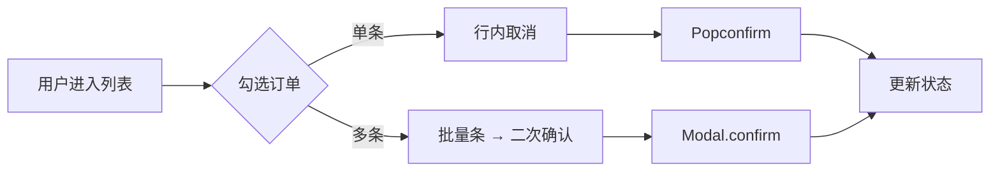
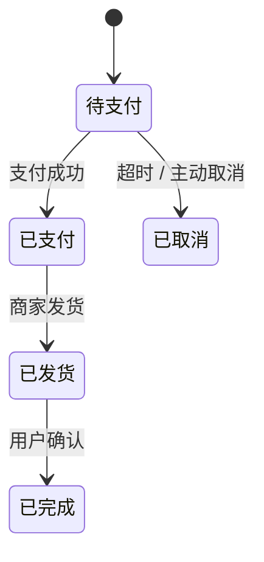

# PRD 风格锚点

> 这份文件**告诉 Claude 该用什么口味写 PRD**。
> 它和 `product-design-preferences.md`（讲 UI 偏好）、`user-profile.md`（讲我是谁）互补，专门聚焦"PRD 这种文档怎么写"。
>
> 配套范例：`knowledge/prd-example-*.md`（具体长什么样去那里看）。

---

## 1. 整体气质

我喜欢的 PRD：

- **精确 > 篇幅**。能用一个表格说清的，不要写一段话
- **业务术语用中文，技术字段用英文**（`order_id` / `status`）
- **mermaid 优先**。流程图、状态机、序列图能 mermaid 就 mermaid，不要 ASCII 画图、不要"附设计稿截图"
- **markdown table 优先**。字段表、权限表、异常表都用表格，不要用 bullet 嵌套层级
- **节奏紧凑**。一节内不要超过 3 个 ## 层级（### 最多再带一层 ####）

我**不喜欢**的 PRD：

- ❌ 一段开场白吹立项背景（"随着……日益重要……")
- ❌ "本文档旨在……" 这种公式化开头
- ❌ 长段废话："为了更好地服务用户，提升业务效率，我们……"
- ❌ "用户故事" 写成 "用户A 想要 B 功能 C 因此能 D" 反复套同一模板
- ❌ 名词堆叠："订单管理中心增强方案"——动名结构更好："订单批量取消"
- ❌ 把字段说明写成段落（"订单号是订单的唯一标识符……"），应该用表格

---

## 2. 句法偏好

### 2.1 标题用动名结构

| 不好 | 好 |
|---|---|
| 订单管理 | 批量取消订单 |
| 退款审批流程优化 | 退款审批：增加二级审核 |
| 包裹拦截功能 | 拦截已发包裹 |
| 字段配置中心 | 配置自定义字段 |

要点：**动词在前，对象在后，特征在最后**。

### 2.2 功能描述用三段式

每个功能就这三块——不需要更多：

```
- 用户价值：[谁] 能 [做什么]，避免/获得 [什么]
- 主流程：1) … 2) … 3) …
- 验收：[条件 A] + [条件 B] + [条件 C]
```

如有异常分支、权限差异、状态变化，加 sub-section，不强行塞进主流程。

### 2.3 字段一律表格

```markdown
| 字段 | 类型 | 必填 | 默认 | 校验 | 备注 |
|---|---|---|---|---|---|
| order_id | string | ✅ | — | `^O-\d{8}-\d{6}$` | 列表主键 |
```

不写"order_id 是订单号，必填，格式是……"。

### 2.4 异常一律表格

```markdown
| 场景 | 系统行为 | 用户提示 |
|---|---|---|
| 网络断 | 暂存本地，5s 后重试 | "网络异常，自动重试中…" |
```

---

## 3. 流程图偏好

### 3.1 必须用 mermaid



### 3.2 状态机用 stateDiagram-v2



### 3.3 序列图用 sequenceDiagram

适合：跨系统流程（支付回调、第三方对接）、抽屉/弹窗触发链。

---

## 4. 措辞偏好

### 4.1 主动语态，不要被动

| 不好 | 好 |
|---|---|
| 订单可以被用户取消 | 用户可取消订单 |
| 状态会被系统更新 | 系统更新状态 |

### 4.2 具体数字，不要"较多/较少"

| 不好 | 好 |
|---|---|
| 较多用户使用 | 周均 1,200+ 用户 |
| 性能较好 | P95 < 800ms |
| 涉及范围较广 | 涉及 7 个业务模块 |

### 4.3 行动导向，不要状态描述

| 不好 | 好 |
|---|---|
| 用户在主页查看订单 | 进入"订单列表"页 |
| 系统提供导出功能 | 点击"导出当前结果"，下载 .xlsx |

---

## 5. 长度与节奏

### 5.1 篇幅参考

| PRD 复杂度 | 期望字数 | 期望页数 |
|---|---|---|
| 简单功能（一个表、一个抽屉、一种动作）| 800-1,500 | 2-3 页 |
| 中等复杂（多角色、多状态、含权限）| 1,500-3,000 | 4-6 页 |
| 重大改造（跨模块、跨系统） | 3,000-5,000 | 7-10 页 |

超过 5,000 字往往说明 PRD 应该拆——拆成 2-3 份独立 PRD 串联。

### 5.2 不要重复

如果一节里有信息在前一节已经说过，**就引用**。比如：

> 状态机参见 §3.2。

不要复制粘贴一遍。

### 5.3 写完一定回头删

PRD 写完，回头读一遍，把"不影响理解的句子"全删掉。一般能砍 20-30%。

---

## 6. 不确定信息的标注

PRD 不能把"猜测"伪装成"事实"。任何不确定的地方用：

- `<待确认>` —— 我没把握、需要业务方答的
- `<假设>` —— 我先按这个做，但需要后续验证的
- `<TODO>` —— 我知道这里有问题，回头补

例：

```
- 状态：已支付 → 已发货
- 触发：商家点击"发货" <待确认：是否支持系统自动发货>
- 假设：发货后 7 天用户未确认，自动完成 <假设：仿淘宝默认>
```

---

## 7. "原型生成输入包"那节怎么写

PRD 第 8 节（详见 `skills/erp-product-manager/references/prd-template.md` §8 模板）的写作要点：

1. **简洁**。不写一句废话——所有信息以表格 + JSON 形式
2. **完整**。7 块全填，没有"不适用"也写明
3. **可执行**。Codex 看完应该能直接干活，不需要再回 Claude 问业务规则
4. **可验证**。每个组件映射到 Figma 库实际存在的组件名（验过的清单见 `knowledge/figma-ant-design-ui-library.md`）

---

## 8. 常见反例（这样写 → 用户会说"重写"）

### 反例 1：开场公式化

> 随着跨境电商业务的快速发展，订单量持续增长，对订单管理的精细化要求日益提高。本 PRD 旨在通过引入批量取消功能，提升运营效率，降低误操作成本。

**应改为**：

> ## 1.1 背景
>
> 现状：客服日均处理 200+ 单"用户主动取消"，目前只能逐条点。
> 痛点：单条操作 30 秒，旺季每天耗费 1.5 小时纯重复劳动。
> 目标：批量取消，让 200 单的处理时间从 100 分钟降到 5 分钟。

### 反例 2：长段字段说明

> 订单号是订单的唯一标识符，由系统自动生成，格式为 `O-` 加日期再加 6 位序号。

**应改为表格**：

| 字段 | 类型 | 必填 | 校验 | 备注 |
|---|---|---|---|---|
| `order_id` | string | ✅ | `^O-\d{8}-\d{6}$` | 列表主键，系统生成不可编辑 |

### 反例 3：堆名词

> 多渠道订单管理平台批量操作能力增强方案

**应改为**：

> # 订单批量取消

---

## 9. 我的偏好可能会变

写完一份 PRD 后我可能会说"这里改一下" "那里不喜欢"——这些反馈应该回到这个文件，不要只在那个 PRD 里改。

Claude 应该：

1. 听到反馈先问"这是一次性调整还是要更新风格锚点？"
2. 如果是"要更新"，编辑本文件 §2-§5 对应小节
3. Changelog 里记一笔

---

## Changelog

- 2026-05-13 · v0.1 初版。从 `user-profile.md` 和 `product-design-preferences.md` 提炼"PRD 写作"专题。
