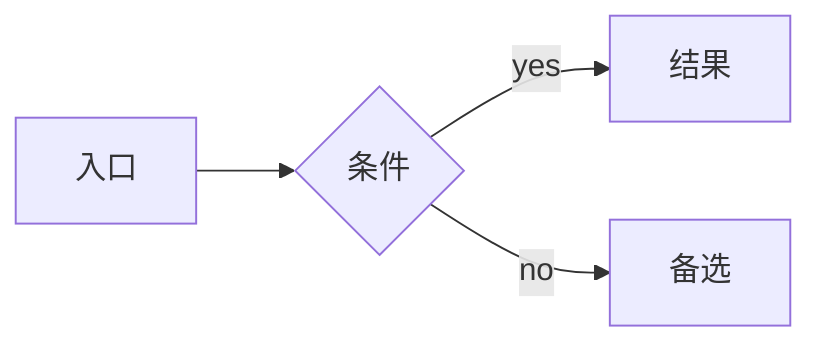
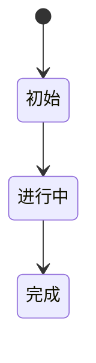

# PRD 模板（合并版 9+1 节）

> 本 PRD 的页面结构、交互方式、组件行为、权限控制与状态定义，均遵循《UI 交互规范主文件》；未单独说明者，默认按该规范执行。
>
> **本项目标准 PRD = 9 节研发级结构 + 第 10 节"原型生成输入包"**
>
> 第 1-9 节给人看（产品 / 研发 / 测试 / 业务）；第 10 节给 Codex 或 Claude 自生原型用。
>
> ⚠️ 强规则：
> - 任何不确定项必须显式标注 `<待确认>` / `<假设>`，不许把猜测伪装成事实
> - 流程图 / 状态机一律 Mermaid，禁止纯文本描述
> - 功能详述、字段、异常、权限一律用 Markdown 表格
> - 验收必须 BDD（Given / When / Then），不许罗列文字
> - 禁用"等"、"类似逻辑"等敷衍词汇——所有枚举穷尽
> - UI 组件必须用 Ant Design（参考 `knowledge/figma-ant-design-ui-library.md`）
> - 需要生成原型的 PRD，必须在第 10 节写清楚 UI 设计契约；不要只写"Ant Design 风格"或"专业后台风格"

---

## 1. 背景与目标

### 1.1 背景

（一段话讲清楚现状 + 问题 + 不做的代价。引用 `knowledge/modules/<module>.md` 把现状写实，含具体数字。）

### 1.2 目标

- **业务目标**（必须数字化）：
- **用户目标**：
- **北极星指标**（定义 + 口径）：

### 1.3 非目标（Out of Scope）

明确这次不做什么——避免范围蔓延。

## 2. 用户与场景

### 2.1 目标用户

| 角色 | 主要任务 | 频率 | 备注 |
|---|---|---|---|
| | | | |

### 2.2 用户故事 / JTBD

- 作为 [角色]，我希望 [能力]，以便 [价值]。

### 2.3 典型场景

（1-2 个真实工作流，带姓名 / 数字 / 时间，让读者有画面感。）

## 3. 业务流程与状态机

### 3.1 主流程（Mermaid 强制）



### 3.2 核心对象状态机



明确**触发动作**和**触发权限**。

### 3.3 逆向 / 异常流程

（撤销、回退、错误恢复——ERP 必须写清楚。）

## 4. 功能详述（按模块输出，**必须表格化 + 7 维度**）

> ⚠️ 7 维度逐一过。本次需求不涉及某维度时，**必须在对应表格内显式注明"本次不涉及"**，不许瞎编凑格式。

### 4.x [模块名]（动名结构，例："批量取消订单"）

#### 4.1 功能定义

| 优先级 | 角色 | 功能点 | 触发条件 | 前置条件 |
|---|---|---|---|---|
| P0 | | | | |

#### 4.2 字段取值逻辑

| 字段名 | 类型 | 必填 | 默认 | 校验规则 | 枚举值 | 逻辑描述 |
|---|---|---|---|---|---|---|
| | string / int / decimal / boolean / datetime / enum / array | ✅ / ❌ | | | | |

#### 4.3 交互说明

| 场景 | Ant Design 组件 | 触发动作 | 前端交互 | 后端逻辑 | 错误处理 |
|---|---|---|---|---|---|
| | Form / Input / Table / Modal / Drawer / Popconfirm / Message / Notification | 点击 / 提交 / 切换页签 / 筛选 | 校验 / 联动 / 显隐 / 刷新 / 排序 | 数据校验 / 幂等 / 状态更新 / 异步任务 / 日志 | 错误码 / 用户提示 / 重试 / 回滚 |

#### 4.4 功能阐述（正向 / 异常路径）

| 路径 | 步骤 | 系统行为 | 用户感知 |
|---|---|---|---|
| 正向 | 1. | | |
| 异常 | | | |

#### 4.5 逆向流程搭建

（退款 / 撤销 / 修正等。**不涉及则**：在下面表格里只写一行 "本次不涉及"。）

| 逆向场景 | 触发角色 | 触发条件 | 数据影响 | 状态回退规则 | 限制条件 |
|---|---|---|---|---|---|
| | | | | | |

#### 4.6 功能权限清单

| 角色 | 页面权限 | 按钮权限 | 字段权限 | 数据范围 | 审批 / 二次确认 |
|---|---|---|---|---|---|
| | 可见 / 不可见 | 可点 / 禁用 / 隐藏 | 可见 / 可编 / 只读 / 隐藏 | 本人 / 部门 / 店铺 / 全部 | |

#### 4.7 上线前历史数据处理

（**不涉及则**：写"本次不涉及"。）

| 数据对象 | 数据来源 | 是否迁移 | 迁移 / 清洗规则 | 默认值策略 | 历史状态处理 | 回滚方案 |
|---|---|---|---|---|---|---|
| | | 是 / 否 | | | | |

## 5. 埋点与可观测性

| 事件名 | 触发时机 | 携带参数 | 用途 |
|---|---|---|---|
| `xxx_view` | 进入页面 | `page_source`、`user_id` | 衡量入口曝光 |
| `xxx_click_filter` | 点击筛选 | `filter_type`、`filter_value` | 衡量功能使用率 |

## 6. 风险、合规与性能要求

| 维度 | 要求 | 备注 |
|---|---|---|
| 并发 | QPS 峰值 X，单接口 P95 < Y ms | |
| 数据脱敏 | 联系电话 / 邮箱 / 身份证显示规则 | |
| 合规 | GDPR / 跨境数据 / 平台规则 | |
| 容灾 | 网络断连 / 第三方异常的兜底 | |

## 7. 验收标准（**BDD 格式强制**）

按 `Given 前置 / When 触发 / Then 预期` 写。

```
Scenario 1: [场景名]
  Given [前置条件]
  When [触发动作]
  Then [预期结果]
  And [附加预期]
```

**例**：

```
Scenario 1: 客服勾选 50 单批量取消
  Given 当前角色是"客服"
    And 列表已勾选 50 条状态为"待支付"或"已支付"的订单
  When 点击"批量取消"按钮
  Then 弹出二次确认 Modal
    And 显示总金额汇总
    And 大额订单（>¥5,000）红色标记
```

每个核心功能至少 3 个 BDD scenario：正向 / 异常 / 边界。

## 8. 里程碑规划与资源预估

| 里程碑 | 时间 | 负责人 | 交付物 | 依赖 |
|---|---|---|---|---|
| PRD 评审 | | | | |
| 开发完成 | | 前端 X md / 后端 Y md | | |
| 灰度发布 | | | 灰度策略 + 名单 | |
| 全量发布 | | | | |

## 9. 开放问题

| 未确认项 | 对研发的阻塞程度 | 当前策略 | 责任方 / 期望 deadline |
|---|---|---|---|
| | 高 / 中 / 低 | | |

---

## 10. 原型生成输入包（给 Codex / Claude 自生原型用）

> 本节是原型生成的**唯一输入**。无论 Claude 自生还是交给 Codex，都只读这一节。
> 协议详细见 `HANDOFF_PROTOCOL.md`。

### 10.0 原型任务单（必填）

| 项目 | 内容 |
|---|---|
| 交付模式 | `prototype-draft` / `prototype-final` |
| 本次页面总数 | 固定数字，禁止生成方自行扩展 |
| 本次明确目标 | 本轮必须交付什么 |
| 本次明确不做 | 本轮禁止扩展什么 |
| 假设项 | 仅允许保守假设，必须显式标注 |

> 生成方必须先复述本任务单，再开始出原型。任务单不完整时，不准开始画。

### 10.1 必读引用

```yaml
figma:
  fileKey: KaI3eGyylfiwrPlU3OR08C
  page_to_use: ""              # 例："04 Templates"
  preferred_template: ""        # 例：ListPageTemplate
  theme_mode: Default           # Default / Dark / Glass（v6 主题）

html_mirror:
  tokens_css: ../../ui-library/tokens.css
  components_dir: ../../ui-library/components/

specs:
  - knowledge/figma-ant-design-ui-library.md
  - knowledge/product-design-preferences.md
  - knowledge/prd-style-anchor.md
  - skills/erp-product-manager/references/ui-interaction-spec.md
  - skills/erp-product-manager/references/erp-reference-patterns.md
  - skills/ui-optimization-master/references/erp-ui-pattern-library.md
```

### 10.2 页面清单（页面总数固定，原型生成方不得新增）

| 页面 ID | 页面名 | 路径建议 | 模板 | 抽屉 / 弹窗 |
|---|---|---|---|---|
| P1 | | | ListPageTemplate | |
| P2 | | | | |

### 10.2A 页面契约表（必填，直接服务原型稳定生成）

| 页面 | 页面目标 | 主任务 | 次任务 | 明确不做 | 布局结构 | 入口 | 跳转去向 |
|---|---|---|---|---|---|---|---|
| P1 | | | | | 标题区 / 筛选区 / 列表区 / 抽屉 | | |

> 每个页面只允许一个最高优先级主任务。没有写进页面契约表的模块，不得自行补入正式原型。

### 10.3 组件映射表

| 页面 | 区域 | Figma 组件 | HTML 镜像 | Ant Design 组件 | 交互语义 | Notes |
|---|---|---|---|---|---|---|
| P1 | 壳层 | ErpShell | components/erp-shell.html | Layout / Sider / Header / Breadcrumb | 后台壳层 | |
| P1 | 标题区 | PageHeaderBar | components/page-header-bar.html | Typography / Space / Button | 页面标题 + 一级主操作 | |
| P1 | 筛选区 | QueryFilterBar | components/query-filter-bar.html | Form / Input / Select / DatePicker / Button | 查询条件收敛 | |
| P1 | 结果区 | DataTablePanel | components/data-table-panel.html | Table / Tag / Pagination / Dropdown | 高频扫描与批量操作 | |
| P1 | 详情 | DetailDrawer | components/detail-drawer.html | Drawer / Descriptions / Tabs / Timeline | 查看优先抽屉 | |

> 组件映射表必须写到"区域"级别。任何控件如果无法映射到 Figma 组件、HTML 镜像或 Ant Design 组件，默认不得进入正式原型。

### 10.3A 页面元素来源映射（必填）

| 页面 | 可见元素 | 来源类型 | 来源位置 | 备注 |
|---|---|---|---|---|
| P1 | 标题 / 页签 / 摘要卡 / 按钮 / 区块标题 | 用户指令 / 方案 / PRD | | |

> 没有来源映射的导航、页签、摘要卡、快捷操作、说明文案、模块标题，不得进入交付物。

### 10.3B UI 设计契约（必填，用于控制跨模型输出差异）

| 页面 | 区域 | 控件 / 元素 | 必用组件 | 状态语义 | 尺寸 / 密度 | 颜色 / Token | 禁止实现 |
|---|---|---|---|---|---|---|---|
| P1 | 平台切换 | Amazon / Shopee / Lazada / TikTok | Segmented / Radio.Group / Tag group（三选一，需明确） | selected / default / hover / disabled | 高度 24-32px，紧凑间距 8px | `var(--color-primary-6)` / `var(--color-primary-bg)` / `var(--color-border-secondary)` | 禁止裸 `button`、浏览器默认按钮、只写 `tag--*` 不写 `.tag` |
| P1 | 主操作 | 查询 / 新建 / 保存 | Button | primary / default / disabled / loading | `--control-height` | `btn btn--primary` 或 v6 `color+variant` 语义 | 禁止自定义蓝色按钮 |
| P1 | 状态展示 | 订单状态 / 任务状态 | Tag | success / processing / warning / error / default | 高度 22px | 使用 `.tag` + `.tag--*` | 禁止只写颜色文字 |
| P1 | 表单输入 | 文本 / 枚举 / 日期 | Input / Select / DatePicker | default / focus / error / disabled | 32px 控件高 | 使用 `.input` / Ant-style select | 禁止可见原生 `<select>` |

> 写 PRD 时不要把 UI 契约写成审美描述。必须落到：控件选择、状态语义、尺寸密度、token、禁止实现。  
> 示例：不要写"平台选项做得高级一点"；应写"平台切换使用 Segmented，选中态使用 primary token，禁止裸 button 和浏览器默认样式"。

### 10.3C 原型实现约束（必填）

| 约束项 | 规则 |
|---|---|
| Token | 必须引入 `ui-library/tokens.css`；禁止在业务原型里重新定义 `:root` 颜色、间距、圆角、阴影变量 |
| 颜色 | 主色使用 `var(--color-primary-6)`；布局背景使用 `var(--color-bg-layout)`；状态色使用 success / warning / error token |
| 组件基础类 | Tag 必须同时具备 `.tag` 和 `.tag--*`；按钮必须使用 `.btn` / Ant Button 语义；输入框必须使用 `.input` / Ant Input 语义 |
| 原生控件 | 正式原型禁止可见原生 `<select>`；裸 `<button>` 只能作为语义节点，必须绑定项目组件类或 Ant 风格类 |
| 布局 | 壳层必须复用 `ErpShell`；列表页默认为标题区、筛选区、结果区；查看优先抽屉 |
| 密度 | ERP 后台默认中高信息密度；禁止营销页式大留白、超大标题、装饰性卡片堆叠 |
| Demo 控件 | 正式原型禁止角色切换器、状态切换器、debug panel、重置演示按钮 |
| 守门脚本 | HTML 原型交付前运行 `node scripts/prototype-style-guard.js prototype/<name>/`；ERROR 必须修复后再交付 |

### 10.4 状态覆盖矩阵

| 页面 | 默认 | 加载 | 空 | 筛选无结果 | 错误 | 成功反馈 | 禁用 | 无权限 |
|---|---|---|---|---|---|---|---|---|
| P1 | | | | | | | | |
| P2 | | | | | | | | |

> 取值：`必` / `可选` / `不适`

### 10.5 风险操作清单

| 动作 | 触发位置 | 风险等级 | 二次确认形式 | 文案 |
|---|---|---|---|---|
| | | 低 / 中 / 高 | Popconfirm / Modal.confirm | |

### 10.6 权限差异表

| 角色 | 进入页面 | 看到字段 | 可操作 | 备注 |
|---|---|---|---|---|
| | ✅ / ❌ | | | |

### 10.6A 交互与组件建议（推荐填写，减少反复查库）

| 页面 | 场景 | 推荐 Ant Design 组件 | 交互要求 | 备注 |
|---|---|---|---|---|
| P1 | 筛选 | Form / Input / Select / DatePicker | 紧凑单行，超出折叠 | |
| P1 | 列表 | Table | 固定列 / 批量选择 / 行内状态 | |
| P1 | 查看详情 | Drawer | 查看优先抽屉，少跳转 | |

### 10.7 Mock 数据样本

```json
[]
```

至少 5-8 条样本，结构真实——让原型生成方不用编。

---

## 全局一致性锚点（每次输出末尾必有）

| 类别 | 内容 |
|---|---|
| 术语表 | 统一业务概念 |
| 目标与指标 | 引用 §1.2 |
| 范围边界 | 引用 §1.3 + §1.1 |
| 关键约束 | 技术 / 成本 / 合规 |
| 已确认决策 Decision Log | 哪些点已和 freddy 拍板 |
| 待确认问题 Open Questions | 引用 §9 |
