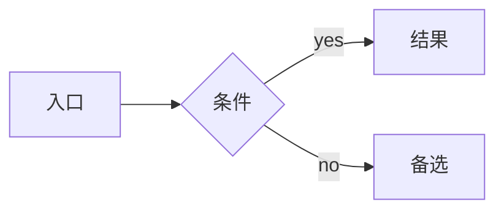

# PRD 模板

> 本 PRD 的页面结构、交互方式、组件行为、权限控制与状态定义，均遵循《UI 交互规范主文件》；未单独说明者，默认按该规范执行。
>
> **PRD 必有第 8 节"原型生成输入包"——这是给 Codex 用的，见末尾。**

## 1. 背景与目标

### 1.1 背景

（一段话讲清楚现状 + 问题 + 不做的代价。引用 `knowledge/modules/<module>.md` 把现状写实。）

### 1.2 目标

- 业务目标（**必须数字化**）：
- 用户目标：
- 北极星指标：

### 1.3 非目标（Out of Scope）

（明确这次不做什么，避免范围蔓延。）

## 2. 用户与场景

### 2.1 目标用户

| 角色 | 主要任务 | 频率 | 备注 |
|---|---|---|---|
| | | | |

### 2.2 用户故事

- 作为 [角色]，我希望 [能力]，以便 [价值]。
- ……

### 2.3 典型场景

（1-2 个真实工作流，带姓名、数字、时间，让读者有画面感。）

## 3. 功能范围

### 3.1 功能清单（含优先级）

| ID | 功能名 | 优先级 | 备注 |
|---|---|---|---|
| F1 | | P0 | |
| F2 | | P1 | |

### 3.2 主流程（mermaid）



### 3.3 逆向 / 异常流程

（撤销、回退、错误恢复——ERP 必须写清楚。）

## 4. 页面清单

| 页面 ID | 页面名称 | 用户入口 | 主任务 | 涉及功能 |
|---|---|---|---|---|
| P1 | | | | F1, F2 |
| P2 | | | | F3 |

## 5. 功能说明

### 5.1 [功能名]（动名结构，例："批量取消订单"）

- **用户价值**：
- **触发条件**：
- **主流程**：
- **异常流程**：
- **权限影响**：
- **页面影响**：
- **状态变化**：（含 mermaid 状态机如需）
- **是否支持撤回**：
- **验收标准**：
  - [ ]
  - [ ]

### 5.2 [下一个功能]

（同上结构）

## 6. 页面说明

### 6.1 [页面名]

- **页面目标**：
- **用户入口**：
- **页面结构**：
  - 标题区：
  - 筛选区：（高频字段 + 低频折叠）
  - 内容区：（表格 / 卡片 / 表单）
  - 抽屉 / 弹窗：
- **核心操作**：
- **权限差异**：
- **校验与反馈**：
- **状态说明**：（默认 / 加载 / 空 / 筛选无结果 / 错误 / 成功 / 禁用 / 无权限）
- **边界情况**：

### 6.2 [下一个页面]

（同上结构）

## 7. 风险与未决问题

| 风险 / 未决 | 影响 | 当前策略 | 待澄清问题 |
|---|---|---|---|
| | | | |

---

## 8. 原型生成输入包（Codex 消费）

> 本节专门给 Codex 看。Codex 应该只读这一节就能开工。
> 协议详细规则见 `HANDOFF_PROTOCOL.md`。

### 8.1 必读引用

```yaml
figma:
  fileKey: KaI3eGyylfiwrPlU3OR08C
  page_to_use: ""              # 例："04 Templates"，留空则按需选
  preferred_template: ""        # 例：ListPageTemplate / 自定义

html_mirror:
  tokens_css: ../../ui-library/tokens.css
  components_dir: ../../ui-library/components/

specs:
  - knowledge/figma-ant-design-ui-library.md
  - knowledge/product-design-preferences.md
  - skills/erp-product-manager/references/ui-interaction-spec.md
  - skills/erp-product-manager/references/erp-reference-patterns.md
  - skills/ui-optimization-master/references/erp-ui-pattern-library.md
```

### 8.2 页面清单（页面总数固定，Codex 不得新增）

| 页面 ID | 页面名 | 路径建议 | 模板 | 抽屉 / 弹窗 |
|---|---|---|---|---|
| P1 | | | ListPageTemplate | |
| P2 | | | | |

### 8.3 组件映射表

| 页面 | 区域 | Figma 组件 | HTML 镜像 | Notes |
|---|---|---|---|---|
| P1 | 壳层 | ErpShell | components/erp-shell.html | |
| P1 | 标题区 | PageHeaderBar | components/page-header-bar.html | |
| P1 | 筛选区 | QueryFilterBar | components/query-filter-bar.html | |
| P1 | 结果区 | DataTablePanel | components/data-table-panel.html | |
| P1 | 详情 | DetailDrawer | components/detail-drawer.html | |

### 8.4 状态覆盖矩阵

| 页面 | 默认 | 加载 | 空 | 筛选无结果 | 错误 | 成功反馈 | 禁用 | 无权限 |
|---|---|---|---|---|---|---|---|---|
| P1 | | | | | | | | |
| P2 | | | | | | | | |

> 取值：`必` / `可选` / `不适`

### 8.5 风险操作清单

| 动作 | 触发位置 | 风险等级 | 二次确认形式 | 文案 |
|---|---|---|---|---|
| | | 低 / 中 / 高 | Popconfirm / Modal.confirm | |

### 8.6 权限差异表

| 角色 | 进入页面 | 看到字段 | 可操作 | 备注 |
|---|---|---|---|---|
| | ✅ / ❌ | | | |

### 8.7 Mock 数据样本

```json
[]
```

至少 5-8 条样本，结构真实——让 Codex 不用编。
